# Copyparty Markdown Viewer — Software Design Document

> A self-contained [copyparty](https://github.com/9001/copyparty) browser plugin that
> upgrades copyparty's Markdown viewing with Mermaid / PlantUML / Kroki diagrams,
> KaTeX math, syntax highlighting, a table-of-contents, in-document search, zoomable
> diagrams, whole-document zoom, theming, and client-side export — delivered as one
> bundled JS artifact loaded via copyparty's `--js-other` hook.

| Field            | Value                                                            |
|------------------|-----------------------------------------------------------------|
| Document type    | Software Design Document (High-Level + Low-Level Design)         |
| Component        | `copyparty-markdown-viewer` (a.k.a. "mdplus")                    |
| Version          | 0.1.0                                                            |
| Date             | 2026-06-21                                                       |
| Author context   | techcaotri@gmail.com                                             |
| Target runtime   | Browser (the copyparty markdown viewer page, `md.html`)          |
| Verified against | copyparty v1.20.2 (also deployed on v1.19.17)                    |
| Build tool       | esbuild (single IIFE bundle, CSS inlined)                        |

---

## Table of Contents

1. [Introduction and Scope](#1-introduction-and-scope)
2. [Design Goals, Principles, and Constraints](#2-design-goals-principles-and-constraints)
3. [High-Level Design](#3-high-level-design)
4. [Low-Level Design: Static Structure](#4-low-level-design-static-structure)
5. [Main Classes — 5W1H Analysis](#5-main-classes--5w1h-analysis)
6. [Dynamic Behavior: Sequence, Collaboration, Activity, State](#6-dynamic-behavior-sequence-collaboration-activity-state)
7. [Workflow Deep-Dive: Inputs, Intermediates, Outputs per Phase](#7-workflow-deep-dive-inputs-intermediates-outputs-per-phase)
8. [Data Design and Contracts](#8-data-design-and-contracts)
9. [Cross-Cutting Concerns](#9-cross-cutting-concerns)
10. [Copyparty Integration Contract](#10-copyparty-integration-contract)
11. [Extensibility Guide](#11-extensibility-guide)
12. [Appendix: File Map, Config Reference, Glossary](#12-appendix-file-map-config-reference-glossary)

---

## 1. Introduction and Scope

### 1.1 Purpose

This document describes the software design of the Copyparty Markdown Viewer plugin
("mdplus"). It covers both the **High-Level Design** (system context, deployment,
layered architecture, build pipeline) and the **Low-Level Design** (class structure,
per-class responsibilities via 5W1H, dynamic interactions, and a phase-by-phase
breakdown of every workflow's input data, intermediate artifacts, and output data).

### 1.2 What the system does (in one paragraph)

Copyparty serves a built-in Markdown viewer page (`md.html`) that renders `.md` files
with the `marked` parser and `Prism` highlighter, but does not render diagrams or
math. mdplus is a JavaScript bundle injected into that page. When a Markdown view is
detected, mdplus reads the raw Markdown (already present in copyparty's `#mt`
textarea), re-renders it with a richer `markdown-it` pipeline (math, footnotes, task
lists, admonitions, highlighting), sanitizes the HTML, replaces copyparty's native
output, upgrades fenced diagram blocks into real diagrams (Mermaid in-browser,
PlantUML/Graphviz via a configurable server), and mounts a feature UI (toolbar, ToC,
search, diagram zoom, whole-document zoom, export, theme toggle).

### 1.3 Scope

In scope: client-side rendering, diagram upgrading, feature UI, copyparty DOM
integration, build/vendoring. Out of scope: copyparty's server, authentication,
uploads, and any server-side rendering or server-side export (PDF/PNG/ePub).

---

## 2. Design Goals, Principles, and Constraints

```
+------+-------------------------------------------------------------------------+
| Code | Goal / Principle / Constraint                                           |
+------+-------------------------------------------------------------------------+
| G1   | Self-contained: one bundled artifact; no runtime service except an      |
|      | optional self-hosted PlantUML/Kroki server.                             |
| G2   | Non-invasive: no copyparty fork; load only via --js-other/--js-browser. |
| G3   | Upgrade-safe: depend on resilient hooks (MutationObserver, URL, known    |
|      | DOM ids), never copyparty's private JS functions.                       |
| G4   | Reuse-by-copy: vendor the proven rendering bits from Markdown-Preview-   |
|      | Unified (PlantUML encoder, themes, constants) instead of re-deriving.    |
| G5   | Graceful degradation: a missing library or diagram backend must never    |
|      | blank the page; fall back to highlighted source.                       |
| G6   | Performance: lazy-load heavy libs (Mermaid, KaTeX CSS), cache renders    |
|      | and diagrams, never block the UI on a slow diagram backend.            |
| G7   | Security: sanitize all rendered HTML/SVG (DOMPurify), no public diagram  |
|      | host by default (avoid SSRF / privacy leaks).                          |
| G8   | Extensibility: new diagram types are new adapters behind one interface.  |
+------+-------------------------------------------------------------------------+
```

**Key design patterns used:** Composition Root (`MarkdownPlusPlugin`), Mediator /
Orchestrator (`RenderCoordinator`), Strategy + Adapter (`IDiagramAdapter`
implementations behind `DiagramManager`), Facade (`FeatureUI`, `LibraryLoader`),
Observer (`MarkdownViewDetector` via `MutationObserver`), and Cache-aside
(`RenderCache`).

---

## 3. High-Level Design

### 3.1 System context

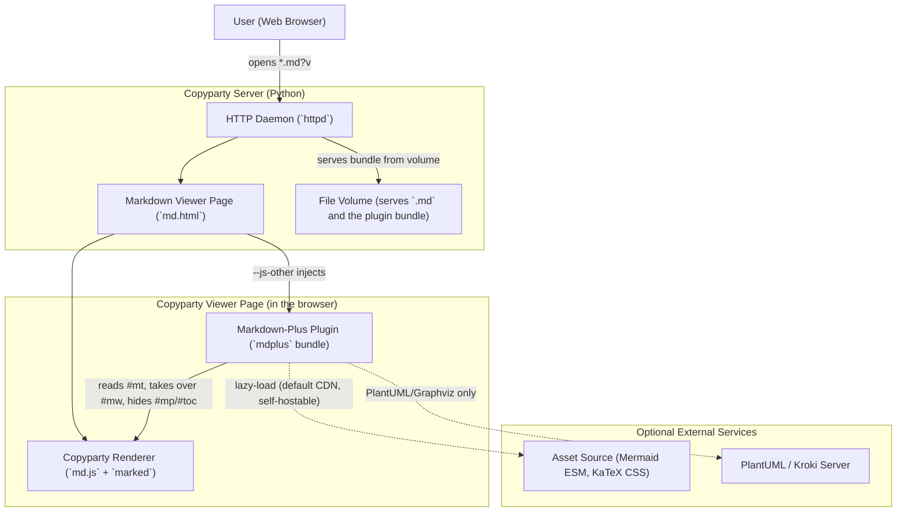
```mermaid
%% System context: the plugin runs inside copyparty's markdown viewer page in the
%% browser, and only optionally reaches out to a diagram server / asset CDN.
flowchart TB
    User["User (Web Browser)"]

    subgraph CopypartyServer["Copyparty Server (Python)"]
        Httpd["HTTP Daemon (`httpd`)"]
        MdHtml["Markdown Viewer Page (`md.html`)"]
        Volume["File Volume (serves `.md` and the plugin bundle)"]
    end

    subgraph Page["Copyparty Viewer Page (in the browser)"]
        CopypartyMd["Copyparty Renderer (`md.js` + `marked`)"]
        Plugin["Markdown-Plus Plugin (`mdplus` bundle)"]
    end

    subgraph External["Optional External Services"]
        AssetCdn["Asset Source (Mermaid ESM, KaTeX CSS)"]
        DiagramSrv["PlantUML / Kroki Server"]
    end

    User -->|"opens *.md?v"| Httpd
    Httpd --> MdHtml
    Httpd -->|"serves bundle from volume"| Volume
    MdHtml -->|"--js-other injects"| Plugin
    MdHtml --> CopypartyMd
    Plugin -->|"reads #mt, takes over #mw, hides #mp/#toc"| CopypartyMd
    Plugin -. "lazy-load (default CDN, self-hostable)" .-> AssetCdn
    Plugin -. "PlantUML/Graphviz only" .-> DiagramSrv
```

**Explanation.** The browser requests a `.md` with the `?v` query, which makes
copyparty serve its markdown viewer page. copyparty injects the mdplus bundle via the
`--js-other` flag. mdplus then coexists with copyparty's own renderer: it reads the
raw source from copyparty's `#mt` textarea, renders its own richer output into `#mw`,
and hides copyparty's native output (`#mp`) and ToC (`#toc`). The only edges that may
leave the browser are the dotted ones: lazy-loading Mermaid/KaTeX assets (default
CDN, fully self-hostable) and requesting PlantUML/Graphviz images from a configured
server. With no diagrams using PlantUML and assets self-hosted, mdplus makes zero
external requests.

### 3.2 Deployment view

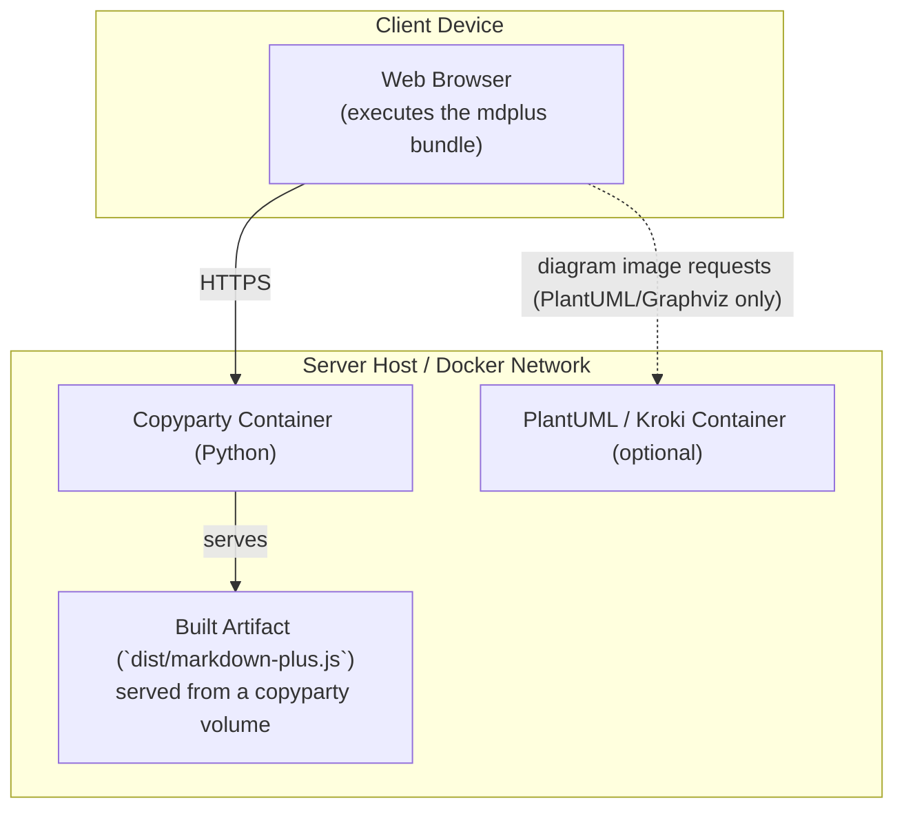
```mermaid
%% Deployment: what runs where. Only copyparty is mandatory at runtime.
flowchart TB
    subgraph Client["Client Device"]
        Browser["Web Browser<br/>(executes the mdplus bundle)"]
    end

    subgraph Host["Server Host / Docker Network"]
        Copyparty["Copyparty Container (Python)"]
        BundleFile["Built Artifact (`dist/markdown-plus.js`)<br/>served from a copyparty volume"]
        Kroki["PlantUML / Kroki Container (optional)"]
    end

    Browser -->|"HTTPS"| Copyparty
    Copyparty -->|"serves"| BundleFile
    Browser -. "diagram image requests (PlantUML/Graphviz only)" .-> Kroki
```

**Explanation.** The baseline deployment is a single copyparty process plus the built
bundle living on one of its volumes (so the browser loads it same-origin while
authenticated). An optional PlantUML/Kroki container is needed only for
PlantUML/Graphviz diagrams. There is no Node.js sidecar and no reverse proxy
requirement.

### 3.3 Build and vendoring pipeline

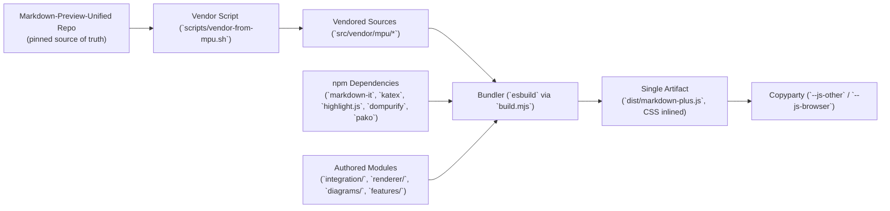
```mermaid
%% Build-time pipeline: vendored MPU source + npm deps + authored glue -> one bundle.
flowchart LR
    Mpu["Markdown-Preview-Unified Repo<br/>(pinned source of truth)"]
    VendorScript["Vendor Script (`scripts/vendor-from-mpu.sh`)"]
    Vendored["Vendored Sources (`src/vendor/mpu/*`)"]
    Npm["npm Dependencies<br/>(`markdown-it`, `katex`, `highlight.js`, `dompurify`, `pako`)"]
    Authored["Authored Modules<br/>(`integration/`, `renderer/`, `diagrams/`, `features/`)"]
    Esbuild["Bundler (`esbuild` via `build.mjs`)"]
    Artifact["Single Artifact<br/>(`dist/markdown-plus.js`, CSS inlined)"]
    Copyparty["Copyparty (`--js-other` / `--js-browser`)"]

    Mpu --> VendorScript --> Vendored
    Vendored --> Esbuild
    Npm --> Esbuild
    Authored --> Esbuild
    Esbuild --> Artifact --> Copyparty
```

**Explanation.** `vendor-from-mpu.sh` copies a pinned set of portable modules
(PlantUML encoder, Catppuccin diagram themes/skinparams, shared constants) into
`src/vendor/mpu/`. `build.mjs` runs esbuild to bundle the vendored sources, the npm
dependencies, and the authored modules into a single IIFE artifact with the CSS
inlined (imported as text and injected at runtime). Updating to a newer upstream is
"re-run the vendor script at a new pin, rebuild, retest" — there is never a runtime
link to the upstream project.

### 3.4 Layered architecture

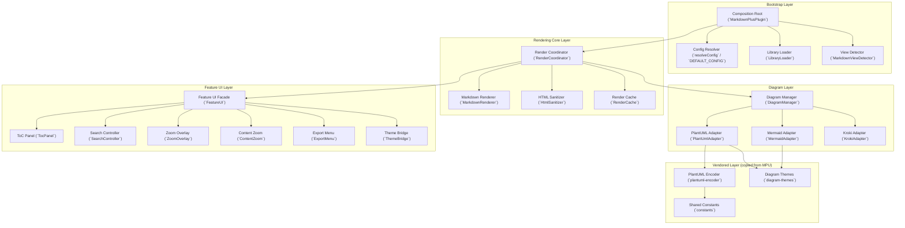
```mermaid
%% Logical layers. Arrows point from higher layers to the layers they depend on.
flowchart TB
    subgraph Bootstrap["Bootstrap Layer"]
        Plugin["Composition Root (`MarkdownPlusPlugin`)"]
        Config["Config Resolver (`resolveConfig` / `DEFAULT_CONFIG`)"]
        Loader["Library Loader (`LibraryLoader`)"]
        Detector["View Detector (`MarkdownViewDetector`)"]
    end

    subgraph Core["Rendering Core Layer"]
        Coordinator["Render Coordinator (`RenderCoordinator`)"]
        Renderer["Markdown Renderer (`MarkdownRenderer`)"]
        Sanitizer["HTML Sanitizer (`HtmlSanitizer`)"]
        Cache["Render Cache (`RenderCache`)"]
    end

    subgraph Diagrams["Diagram Layer"]
        DiagramMgr["Diagram Manager (`DiagramManager`)"]
        Mermaid["Mermaid Adapter (`MermaidAdapter`)"]
        Plant["PlantUML Adapter (`PlantUmlAdapter`)"]
        Kroki["Kroki Adapter (`KrokiAdapter`)"]
    end

    subgraph Features["Feature UI Layer"]
        FeatureUI["Feature UI Facade (`FeatureUI`)"]
        Toc["ToC Panel (`TocPanel`)"]
        Search["Search Controller (`SearchController`)"]
        Zoom["Zoom Overlay (`ZoomOverlay`)"]
        CZoom["Content Zoom (`ContentZoom`)"]
        Export["Export Menu (`ExportMenu`)"]
        Theme["Theme Bridge (`ThemeBridge`)"]
    end

    subgraph Vendor["Vendored Layer (copied from MPU)"]
        Encoder["PlantUML Encoder (`plantuml-encoder`)"]
        Themes["Diagram Themes (`diagram-themes`)"]
        Constants["Shared Constants (`constants`)"]
    end

    Plugin --> Config
    Plugin --> Loader
    Plugin --> Detector
    Plugin --> Coordinator
    Coordinator --> Renderer
    Coordinator --> Sanitizer
    Coordinator --> Cache
    Coordinator --> DiagramMgr
    Coordinator --> FeatureUI
    DiagramMgr --> Mermaid
    DiagramMgr --> Plant
    DiagramMgr --> Kroki
    Mermaid --> Themes
    Plant --> Encoder
    Plant --> Themes
    Encoder --> Constants
    FeatureUI --> Toc
    FeatureUI --> Search
    FeatureUI --> Zoom
    FeatureUI --> CZoom
    FeatureUI --> Export
    FeatureUI --> Theme
```

**Explanation.** Four authored layers plus a vendored layer. The Bootstrap layer
wires everything and discovers when to act. The Rendering Core turns Markdown text
into safe DOM. The Diagram layer upgrades fenced blocks via interchangeable adapters.
The Feature UI layer adds interactive chrome. The Vendored layer holds copied,
dependency-light MPU code that the diagram adapters reuse. Dependencies flow strictly
downward; the only cross-layer reach is the Diagram and Feature layers being driven
by the Coordinator.

### 3.5 Module overview

```
+----------------------------+-----------------------------------------------------+
| Module / File              | Responsibility (one line)                           |
+----------------------------+-----------------------------------------------------+
| integration/index.js       | Composition root + IIFE bootstrap (window.mdPlus).  |
| integration/config.js      | Resolve runtime config from defaults+window+args.   |
| integration/library-loader | Lazy, deduped loading of Mermaid + KaTeX CSS.       |
| integration/detector.js    | Detect markdown views, get source, find host.       |
| integration/coordinator.js | Orchestrate render -> sanitize -> mount -> upgrade. |
| integration/cache.js       | LRU content/diagram cache (FNV-1a keys).            |
| integration/sanitizer.js   | DOMPurify wrapper for HTML/SVG/MathML.             |
| integration/styles.css     | Themed content + chrome styles (inlined at build).  |
| renderer/markdown-renderer | markdown-it pipeline (math, admonitions, fences).   |
| diagrams/index.js          | DiagramManager: route blocks to adapters + cache.   |
| diagrams/mermaid-adapter   | Render Mermaid in-browser (themed).                |
| diagrams/plantuml-adapter  | Encode PlantUML -> image from a PlantUML server.    |
| diagrams/kroki-adapter     | POST to a Kroki server for many diagram types.      |
| features/index.js          | FeatureUI: build chrome (SVG icons), wire features.  |
| features/toc.js            | Build a navigable table of contents.               |
| features/search.js         | In-document search + highlight + navigation.        |
| features/zoom.js           | Fullscreen zoom/pan overlay for diagrams.          |
| features/content-zoom.js   | Toolbar zoom in/out for the whole document.         |
| features/export.js         | Standalone HTML export + print-to-PDF.             |
| features/theme-bridge.js   | Light/dark toggle that re-renders to recolor.       |
| vendor/mpu/...             | Copied MPU: encoder, themes, constants.            |
+----------------------------+-----------------------------------------------------+
```

---

## 4. Low-Level Design: Static Structure

### 4.1 Full class diagram

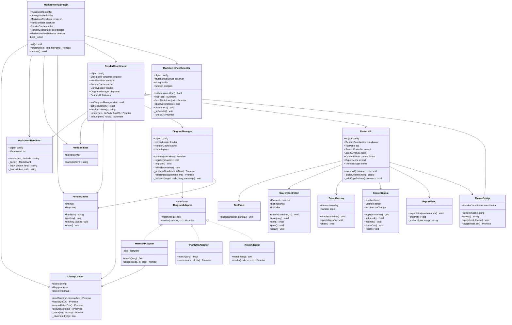
```mermaid
%% Static class model. Identifiers are the real class names -- descriptive roles are in
%% the summary table that follows. The diagram backends share an implicit interface
%% (match + render), shown here as IDiagramAdapter.
classDiagram
    class MarkdownPlusPlugin {
        +PluginConfig config
        +LibraryLoader loader
        +MarkdownRenderer renderer
        +HtmlSanitizer sanitizer
        +RenderCache cache
        +RenderCoordinator coordinator
        +MarkdownViewDetector detector
        -bool _inited
        +init() void
        +renderInto(el, text, filePath) Promise
        +destroy() void
    }

    class LibraryLoader {
        +object config
        +Map promises
        +object mermaid
        +loadScript(url, timeoutMs) Promise
        +loadStyle(url) Promise
        +ensureKatexCss() Promise
        +ensureMermaid() Promise
        -_once(key, factory) Promise
        -_isMermaid(obj) bool
    }

    class MarkdownViewDetector {
        +object config
        +MutationObserver observer
        +string lastUrl
        +function onOpen
        +isMarkdownUrl(url) bool
        +findHost() Element
        +fetchMarkdown(url) Promise
        +observe(onOpen) void
        +disconnect() void
        -_schedule() void
        -_check() Promise
    }

    class RenderCoordinator {
        +object config
        +MarkdownRenderer renderer
        +HtmlSanitizer sanitizer
        +RenderCache cache
        +LibraryLoader loader
        +DiagramManager diagrams
        +FeatureUI features
        +setDiagramManager(dm) void
        +setFeatureUI(fu) void
        +resolveTheme() string
        +render(text, filePath, hostEl) Promise
        -_mount(html, hostEl) Element
    }

    class MarkdownRenderer {
        +object config
        +MarkdownIt md
        +render(text, filePath) string
        -_build() MarkdownIt
        -_highlight(str, lang) string
        -_fence(token, md) string
    }

    class HtmlSanitizer {
        +object config
        +sanitize(html) string
    }

    class RenderCache {
        +int max
        +Map map
        +hash(str) string
        +get(key) any
        +set(key, value) void
        +clear() void
    }

    class DiagramManager {
        +object config
        +LibraryLoader loader
        +RenderCache cache
        +List adapters
        +process(container) Promise
        +register(adapter) void
        -_register() void
        -_isDark(container) bool
        -_processOne(block, isDark) Promise
        -_withTimeout(promise, ms) Promise
        -_fallback(target, code, lang, message) void
    }

    class IDiagramAdapter {
        <<interface>>
        +match(lang) bool
        +render(code, el, ctx) Promise
    }
    class MermaidAdapter {
        -bool _lastDark
        +match(lang) bool
        +render(code, el, ctx) Promise
    }
    class PlantUmlAdapter {
        +match(lang) bool
        +render(code, el, ctx) Promise
    }
    class KrokiAdapter {
        +match(lang) bool
        +render(code, el, ctx) Promise
    }

    class FeatureUI {
        +object config
        +RenderCoordinator coordinator
        +TocPanel toc
        +SearchController search
        +ZoomOverlay zoom
        +ContentZoom contentZoom
        +ExportMenu export
        +ThemeBridge theme
        +mountAll(container, ctx) void
        -_buildChrome(host) object
        -_addCopyButtons(container) void
    }

    class TocPanel {
        +build(container, panelEl) void
    }
    class SearchController {
        +Element container
        +List matches
        +int index
        +attach(container, ui) void
        +run(query) void
        +next() void
        +prev() void
        +clear() void
    }
    class ZoomOverlay {
        +Element overlay
        +number scale
        +attach(container) void
        +open(diagram) void
        +close() void
    }
    class ContentZoom {
        +number level
        +Element target
        +function onChange
        +apply(container) void
        +setLevel(v) void
        +zoomIn() void
        +zoomOut() void
        +reset() void
    }
    class ExportMenu {
        +exportHtml(container, ctx) void
        +printPdf() void
        -_collectStyleLinks() string
    }
    class ThemeBridge {
        +RenderCoordinator coordinator
        +current(host) string
        +saved() string
        +apply(host, theme) void
        +toggle(host, ctx) Promise
    }

    MarkdownPlusPlugin --> LibraryLoader
    MarkdownPlusPlugin --> MarkdownRenderer
    MarkdownPlusPlugin --> HtmlSanitizer
    MarkdownPlusPlugin --> RenderCache
    MarkdownPlusPlugin --> RenderCoordinator
    MarkdownPlusPlugin --> MarkdownViewDetector
    RenderCoordinator --> MarkdownRenderer
    RenderCoordinator --> HtmlSanitizer
    RenderCoordinator --> RenderCache
    RenderCoordinator --> LibraryLoader
    RenderCoordinator --> DiagramManager
    RenderCoordinator --> FeatureUI
    DiagramManager --> IDiagramAdapter
    IDiagramAdapter <|.. MermaidAdapter
    IDiagramAdapter <|.. PlantUmlAdapter
    IDiagramAdapter <|.. KrokiAdapter
    MermaidAdapter --> LibraryLoader
    DiagramManager --> RenderCache
    FeatureUI --> TocPanel
    FeatureUI --> SearchController
    FeatureUI --> ZoomOverlay
    FeatureUI --> ContentZoom
    FeatureUI --> ExportMenu
    FeatureUI --> ThemeBridge
    ThemeBridge --> RenderCoordinator
```

**Explanation.** `MarkdownPlusPlugin` owns one instance of every collaborator and
injects them into `RenderCoordinator`. The Coordinator is the hub of the rendering
core and holds references to the diagram and feature subsystems (wired after
construction via setters, which breaks the construction cycle between Coordinator,
FeatureUI, and ThemeBridge). The three diagram adapters implement a common implicit
interface (`IDiagramAdapter`) so `DiagramManager` treats them uniformly. `FeatureUI`
is a facade over six small feature controllers; `ThemeBridge` holds a back-reference
to the Coordinator so a theme toggle can trigger a re-render.

#### Class summary table

```
+----------------------+--------------------------------------+----------------------+
| Class                | Descriptive role                     | Key collaborators    |
+----------------------+--------------------------------------+----------------------+
| MarkdownPlusPlugin   | Composition root + bootstrap.        | all (owns them)      |
| LibraryLoader        | Lazy/deduped Mermaid + KaTeX loader. | Coordinator, Mermaid |
|                      |                                      | Adapter              |
| MarkdownViewDetector | Detects md views, gets source+host.  | Plugin (callback)    |
| RenderCoordinator    | Orchestrates the render pipeline.    | Renderer, Sanitizer, |
|                      |                                      | Cache, Diagrams, UI  |
| MarkdownRenderer     | markdown-it -> HTML (math/fences).   | (bundled libs)       |
| HtmlSanitizer        | DOMPurify sanitize HTML/SVG/MathML.  | Coordinator          |
| RenderCache          | LRU content + per-diagram cache.     | Coordinator, Diagrams|
| DiagramManager       | Route diagram blocks to adapters.    | adapters, Cache      |
| IDiagramAdapter      | Interface: match(lang)+render().     | DiagramManager       |
| MermaidAdapter       | In-browser Mermaid render (themed).  | LibraryLoader, Themes|
| PlantUmlAdapter      | Encode PlantUML -> server image.     | Encoder, Themes      |
| KrokiAdapter         | POST to Kroki for many types.        | Kroki server         |
| FeatureUI            | Facade: build chrome, wire features. | 5 feature classes    |
| TocPanel             | Build navigable ToC from headings.   | FeatureUI            |
| SearchController     | In-doc search/highlight/navigate.    | FeatureUI            |
| ZoomOverlay          | Themed framed diagram window.        | FeatureUI            |
| ContentZoom          | Toolbar whole-document zoom in/out.  | FeatureUI            |
| ExportMenu           | HTML export + print-to-PDF.          | FeatureUI            |
| ThemeBridge          | Theme toggle that re-renders.        | FeatureUI, Coordinator|
+----------------------+--------------------------------------+----------------------+
```

### 4.2 Package / directory structure

```
src/
  integration/   bootstrap + rendering core + glue (authored)
  renderer/      markdown-it pipeline (authored, mirrors MPU engine)
  diagrams/      DiagramManager + Mermaid/PlantUML/Kroki adapters (authored)
  features/      FeatureUI + ToC/search/zoom/export/theme (authored)
  vendor/mpu/    copied MPU source: diagrams/plantuml-encoder.js,
                 diagrams/diagram-themes.js, core/constants.js
build.mjs        esbuild bundler (entry: src/integration/index.js)
dist/            built artifact (gitignored)
```

---

## 5. Main Classes — 5W1H Analysis

Each main class is analysed with **What / Who / Where / When / Why / How**.

### 5.1 `MarkdownPlusPlugin` (composition root)

```
+-------+--------------------------------------------------------------------------+
| What  | The top-level object that constructs and wires every collaborator and    |
|       | exposes the public API (window.mdPlus) with init/renderInto/destroy.      |
| Who   | Instantiated by the IIFE bootstrap at the bottom of integration/index.js. |
|       | Consumed by copyparty's page (auto-init) and by demos/tests (renderInto). |
| Where | src/integration/index.js. Lives once per page as window.mdPlus.           |
| When  | Constructed immediately when the bundle script executes; init() runs on   |
|       | DOMContentLoaded (or right away if the DOM is ready) when autoInit=true.  |
| Why   | Centralizes object creation (Composition Root) so dependencies are        |
|       | explicit, testable, and swappable, and to guard against double-load.      |
| How   | Builds config -> loader/renderer/sanitizer/cache -> coordinator, then     |
|       | injects DiagramManager and FeatureUI into the coordinator via setters,    |
|       | creates the detector, and on init() subscribes to detector.observe with a |
|       | callback that calls coordinator.render(text, filePath, host).             |
+-------+--------------------------------------------------------------------------+
```

### 5.2 `PluginConfig` (config module: `resolveConfig` + `DEFAULT_CONFIG`)

```
+-------+--------------------------------------------------------------------------+
| What  | A pure configuration resolver (not a class): a DEFAULT_CONFIG object and  |
|       | resolveConfig() that merges defaults, window.MDPLUS_CONFIG, and overrides.|
| Who   | Called once by MarkdownPlusPlugin's constructor. Read by every class.     |
| Where | src/integration/config.js.                                               |
| When  | At plugin construction, before any other collaborator is built.          |
| Why   | One source of truth for behavior (diagram backend, asset URLs, feature    |
|       | flags, theme, selectors) so deployments tune via --html-head, not code.   |
| How   | mergeConfig() does a shallow-but-nested merge (the `features` object is    |
|       | merged one level deep) with precedence defaults < window < overrides.     |
+-------+--------------------------------------------------------------------------+
```

### 5.3 `LibraryLoader`

```
+-------+--------------------------------------------------------------------------+
| What  | A lazy, de-duplicated loader for the two heavy runtime assets that are    |
|       | NOT bundled: Mermaid (ESM, dynamic-imported) and KaTeX CSS+fonts.        |
| Who   | Held by the plugin and shared with RenderCoordinator and MermaidAdapter.  |
| Where | src/integration/library-loader.js.                                       |
| When  | ensureKatexCss() is called when a document contains math; ensureMermaid() |
|       | is called the first time a Mermaid block is rendered.                    |
| Why   | Keeps the initial bundle small and the first paint fast (G6), and avoids  |
|       | fetching anything the document does not use; offline-friendly via config. |
| How   | _once() memoizes per-URL promises (and deletes them on failure to allow   |
|       | retry). loadScript() adds a <script> with a 20s timeout; loadStyle()      |
|       | adds a <link>. ensureMermaid() dynamic-imports the ESM build via a        |
|       | Function('u','return import(u)') wrapper (so esbuild keeps it a runtime   |
|       | import) and validates the result with _isMermaid() because copyparty's    |
|       | page exposes an unrelated window.mermaid.                                |
+-------+--------------------------------------------------------------------------+
```

### 5.4 `MarkdownViewDetector`

```
+-------+--------------------------------------------------------------------------+
| What  | The component that decides "is a Markdown file being viewed right now?",  |
|       | obtains the raw Markdown source, and picks the DOM element to render into.|
| Who   | Owned by the plugin; calls back into the plugin's render closure.         |
| Where | src/integration/detector.js.                                            |
| When  | observe() starts a MutationObserver on <html> at init(); _check() runs    |
|       | (debounced 80 ms) on every DOM mutation, hashchange, and popstate.       |
| Why   | copyparty renders asynchronously and varies by version, so detection must |
|       | be DOM/URL-based and resilient (G3), not tied to copyparty internals.     |
| How   | isMarkdownUrl() matches the path against a markdown extension regex.      |
|       | fetchMarkdown() prefers the in-DOM textarea#mt value (no network), then   |
|       | falls back to fetching the file and recovering source from text/markdown, |
|       | a textarea, or a <pre>. findHost() returns the first existing candidate   |
|       | (#mw, #mp, ...) or creates an overlay host. _check() dedups by URL so it  |
|       | renders once per view and ignores its own resulting mutations.           |
+-------+--------------------------------------------------------------------------+
```

### 5.5 `RenderCoordinator`

```
+-------+--------------------------------------------------------------------------+
| What  | The orchestrator (Mediator) that turns (text, filePath, hostEl) into a    |
|       | fully rendered, interactive document.                                    |
| Who   | Built by the plugin with renderer/sanitizer/cache/loader; receives        |
|       | DiagramManager and FeatureUI via setters; invoked by the detector        |
|       | callback and by ThemeBridge (on toggle) and renderInto().               |
| Where | src/integration/coordinator.js.                                         |
| When  | Once per detected view, and again on each theme toggle re-render.        |
| Why   | To keep the end-to-end pipeline in one place with a clear order and       |
|       | well-defined fallback behavior, decoupled from how each step works.      |
| How   | render(): trigger KaTeX CSS (non-blocking) if math is present; look up    |
|       | the cache by content hash, else render+sanitize+store; _mount() injects   |
|       | the HTML into a .mdplus-content article inside the host, applies the      |
|       | theme + width mode, hides #ml/#mp/#toc, reclaims width; then mount the    |
|       | feature UI FIRST (so it never waits on diagrams) and finally await        |
|       | diagram processing; dispatch a 'mdplus:rendered' event. resolveTheme()    |
|       | honors an explicit/saved theme before auto-detecting copyparty's class.  |
+-------+--------------------------------------------------------------------------+
```

### 5.6 `MarkdownRenderer`

```
+-------+--------------------------------------------------------------------------+
| What  | The Markdown-to-HTML engine: a configured markdown-it instance with a     |
|       | plugin stack mirroring Markdown-Preview-Unified plus a custom fence rule. |
| Who   | Owned by the plugin; called by the coordinator (and the smoke test).      |
| Where | src/renderer/markdown-renderer.js.                                       |
| When  | On a cache miss for a given source text.                                |
| Why   | copyparty's built-in `marked` lacks math, footnotes, task lists,          |
|       | containers, and a diagram hook; this engine adds them and tags diagram    |
|       | fences for later upgrading (G4).                                        |
| How   | _build() configures markdown-it (html, linkify, typographer) with         |
|       | markdown-it-anchor, -emoji, -footnote, -task-lists, -container (six       |
|       | admonitions), and texmath+KaTeX. A custom fence renderer emits diagram    |
|       | languages verbatim as <pre class="mdplus-diagram-src" data-diagram-lang>  |
|       | and highlights other code via highlight.js (common languages).          |
+-------+--------------------------------------------------------------------------+
```

### 5.7 `HtmlSanitizer`

```
+-------+--------------------------------------------------------------------------+
| What  | A thin DOMPurify wrapper that sanitizes the renderer's HTML before it     |
|       | touches the live DOM.                                                    |
| Who   | Owned by the plugin; called by the coordinator on every cache miss.      |
| Where | src/integration/sanitizer.js.                                          |
| When  | Immediately after MarkdownRenderer.render() and before caching/mounting. |
| Why   | The Markdown is untrusted (anyone can upload a .md), so rendered HTML and |
|       | KaTeX MathML/SVG must be XSS-sanitized (G7).                            |
| How   | sanitize() calls DOMPurify with HTML+SVG+MathML profiles, allows a few    |
|       | table/task-list attributes, forbids script/style/iframe and inline event |
|       | handlers. A one-time afterSanitizeAttributes hook adds target=_blank and  |
|       | rel=noopener to external links. Mermaid SVG and PlantUML  are added  |
|       | later by trusted code, not routed through here.                         |
+-------+--------------------------------------------------------------------------+
```

### 5.8 `RenderCache`

```
+-------+--------------------------------------------------------------------------+
| What  | A small LRU cache keyed by a content hash, used at two levels: whole-     |
|       | document HTML and per-diagram rendered output.                          |
| Who   | Shared by the coordinator (document HTML) and DiagramManager (diagrams).  |
| Where | src/integration/cache.js.                                               |
| When  | Read/written on every render and every diagram upgrade.                 |
| Why   | Avoids re-parsing unchanged documents and re-rendering unchanged diagrams |
|       | (e.g. on theme toggle re-render only diagrams change) (G6).             |
| How   | hash() is a 32-bit FNV-1a returning 8 hex chars; get() re-inserts on read |
|       | for LRU recency; set() evicts the oldest beyond `max` (64). DiagramManager|
|       | keys include the theme so light/dark variants cache separately.         |
+-------+--------------------------------------------------------------------------+
```

### 5.9 `DiagramManager`

```
+-------+--------------------------------------------------------------------------+
| What  | The diagram orchestrator: finds tagged diagram blocks and routes each to  |
|       | the right adapter, with caching, theming, timeouts, and fallback.       |
| Who   | Built by the plugin, injected into the coordinator; drives the adapters.  |
| Where | src/diagrams/index.js.                                                  |
| When  | After the sanitized HTML is mounted, for each render (process()).        |
| Why   | To decouple "find and manage diagram blocks" from "render a specific      |
|       | diagram type", enabling new types via new adapters (G8) and ensuring a    |
|       | bad/slow diagram never blanks the page (G5).                            |
| How   | _register() picks adapters by config (Mermaid always; PlantUML or Kroki).|
|       | process() finds pre.mdplus-diagram-src, derives the theme, and runs       |
|       | _processOne() for each concurrently. _processOne() replaces the block     |
|       | with a div.mdplus-diagram, checks the per-(lang,theme,source) cache,      |
|       | else races the adapter render against a 25s timeout, caches string output,|
|       | and on any error calls _fallback() to show source + an inline message.   |
+-------+--------------------------------------------------------------------------+
```

### 5.10 `MermaidAdapter`

```
+-------+--------------------------------------------------------------------------+
| What  | An IDiagramAdapter that renders Mermaid diagrams entirely in the browser. |
| Who   | Registered by DiagramManager (always present).                          |
| Where | src/diagrams/mermaid-adapter.js.                                        |
| When  | render() runs for each "mermaid" block; the library loads on first use.  |
| Why   | Mermaid is interactive and pure-client, matching MPU's approach and       |
|       | keeping Mermaid fully self-contained (no server).                      |
| How   | match() returns true for lang==="mermaid". render() awaits               |
|       | LibraryLoader.ensureMermaid(), re-initializes Mermaid with the vendored   |
|       | Catppuccin theme config + configured security level when the theme        |
|       | changes, then calls mermaid.render(id, code) and injects the SVG.       |
+-------+--------------------------------------------------------------------------+
```

### 5.11 `PlantUmlAdapter`

```
+-------+--------------------------------------------------------------------------+
| What  | An IDiagramAdapter that renders PlantUML by encoding the source and       |
|       | requesting an image from a PlantUML server.                            |
| Who   | Registered by DiagramManager when diagramBackend = "mermaid+puml".      |
| Where | src/diagrams/plantuml-adapter.js.                                       |
| When  | render() runs for "plantuml"/"puml"/"uml" blocks.                       |
| Why   | PlantUML rendering is not pure-JS; encoding client-side + a self-hosted   |
|       | server preserves privacy and reuses MPU's proven encoder (G4, G7).      |
| How   | Publishes the bundled pako to window.pako so the vendored encoder runs    |
|       | offline; injects theme skinparams (injectPlantUmlTheme), encodes          |
|       | (encodePlantUmlText), builds the URL (getPlantUmlUrl), and loads it into  |
|       | an . Throws if no diagramBackendUrl is configured (-> fallback).   |
+-------+--------------------------------------------------------------------------+
```

### 5.12 `KrokiAdapter`

```
+-------+--------------------------------------------------------------------------+
| What  | An IDiagramAdapter that renders many diagram types via a Kroki server.    |
| Who   | Registered by DiagramManager when diagramBackend = "kroki".             |
| Where | src/diagrams/kroki-adapter.js.                                          |
| When  | render() runs for plantuml/puml/uml/dot/graphviz/kroki blocks.          |
| Why   | One self-hosted server unlocks Graphviz/BPMN/etc. with a uniform API.    |
| How   | Maps the language to a Kroki diagram type, POSTs the source as text/plain |
|       | to `${server}/${type}/${format}`, wraps the response blob in an object   |
|       | URL, and inserts it as an . Throws without diagramBackendUrl.       |
+-------+--------------------------------------------------------------------------+
```

### 5.13 `FeatureUI`

```
+-------+--------------------------------------------------------------------------+
| What  | A facade that builds the floating chrome (toolbar, ToC drawer, search bar)|
|       | and wires the six feature controllers.                                 |
| Who   | Built by the plugin with a back-reference to the coordinator; injected    |
|       | into the coordinator and called by it after each mount.                 |
| Where | src/features/index.js.                                                  |
| When  | mountAll() runs after every render (chrome built once per host).        |
| Why   | To group UI concerns and ensure the chrome appears immediately,          |
|       | independent of diagram completion (G6).                                 |
| How   | mountAll() finds the host, builds chrome once (cached on                 |
|       | host.__mdplusChrome), then per render adds copy buttons, rebuilds the    |
|       | ToC, (re)attaches diagram zoom + search, and applies the persisted       |
|       | document zoom. The chrome is appended to <body> (not the host) so its    |
|       | high z-index is not trapped in copyparty's #mw stacking context. Toolbar |
|       | buttons are inline SVG icons (keyed by data-act, drawn with currentColor |
|       | so they always render -- incl. on Android -- and recolor for theme/      |
|       | active states) and dispatch to toc/search/width/zoom-out/zoom-reset/     |
|       | zoom-in/theme/export/print. The ToC drawer auto-hides on an outside      |
|       | click (clicks on the sidebar/toolbar are ignored). The width button      |
|       | toggles .mdplus-wide on the host and persists the choice; the zoom       |
|       | buttons drive ContentZoom; the coordinator re-applies both on render.    |
+-------+--------------------------------------------------------------------------+
```

### 5.14 `TocPanel`, `SearchController`, `ZoomOverlay`, `ExportMenu`, `ThemeBridge`

```
+------------------+-------------------------------------------------------------+
| Class            | 5W1H (condensed)                                            |
+------------------+-------------------------------------------------------------+
| TocPanel         | What: build a heading outline. Who: FeatureUI. Where:       |
|                  | features/toc.js. When: each render. Why: navigation. How:   |
|                  | collect h1-h4, ensure ids, build links that smooth-scroll.  |
+------------------+-------------------------------------------------------------+
| SearchController | What: in-doc find. Who: FeatureUI. Where: features/search.js.|
|                  | When: on input in the search bar. Why: locate text. How:    |
|                  | TreeWalker over text nodes, wrap matches in <mark>, track    |
|                  | current index, Enter/Shift+Enter to navigate, Esc clears.   |
+------------------+-------------------------------------------------------------+
| ZoomOverlay      | What: themed framed diagram/image window. Who: FeatureUI.    |
|                  | Where: features/zoom.js. When: click a zoomable diagram.     |
|                  | Why: inspect detail. How: clone svg/img into a centered      |
|                  | themed window; Pointer Events drive wheel/pinch zoom + drag/ |
|                  | two-finger pan + double-tap (touch-action:none); backdrop/   |
|                  | close/Esc dismiss.                                          |
+------------------+-------------------------------------------------------------+
| ContentZoom      | What: whole-document zoom in/out. Who: FeatureUI. Where:     |
|                  | features/content-zoom.js. When: toolbar -/%/+ buttons. Why:  |
|                  | legibility (scales font, images, diagrams together). How:   |
|                  | CSS `zoom` on .mdplus-content (font-size fallback), clamped  |
|                  | 50-300% in 10% steps, persisted to localStorage[mdplus-zoom].|
+------------------+-------------------------------------------------------------+
| ExportMenu       | What: client-side export. Who: FeatureUI. Where:            |
|                  | features/export.js. When: toolbar export/print. Why: save/   |
|                  | share. How: serialize content + linked stylesheets into a    |
|                  | standalone .html blob download; printPdf() uses window.print.|
+------------------+-------------------------------------------------------------+
| ThemeBridge      | What: light/dark toggle. Who: FeatureUI. Where:            |
|                  | features/theme-bridge.js. When: toolbar theme button. Why:   |
|                  | user preference + recolor diagrams. How: flip + persist the  |
|                  | theme to localStorage, then re-render via the coordinator    |
|                  | (diagrams re-render for the new theme).                     |
+------------------+-------------------------------------------------------------+
```

### 5.15 Vendored helpers (`plantuml-encoder`, `diagram-themes`, `constants`)

```
+-------+--------------------------------------------------------------------------+
| What  | Copied MPU modules: PlantUML deflate+base64 encoding, Catppuccin Mermaid  |
|       | theme config + PlantUML skinparams, and shared constants (the PlantUML    |
|       | base64 alphabet).                                                       |
| Who   | Used by PlantUmlAdapter and MermaidAdapter.                            |
| Where | src/vendor/mpu/diagrams/* and src/vendor/mpu/core/constants.js.         |
| When  | At diagram render time.                                                 |
| Why   | Reuse-by-copy of proven, dependency-light logic (G4); no runtime tie to  |
|       | the upstream project.                                                   |
| How   | encodePlantUmlText() deflates UTF-8 bytes via pako then maps to PlantUML  |
|       | base64; getMermaidThemeConfig()/injectPlantUmlTheme() produce themed     |
|       | configuration. Refreshed by re-running the vendor script at a new pin.   |
+-------+--------------------------------------------------------------------------+
```

---

## 6. Dynamic Behavior: Sequence, Collaboration, Activity, State

### 6.1 Bootstrap and initialization (sequence)

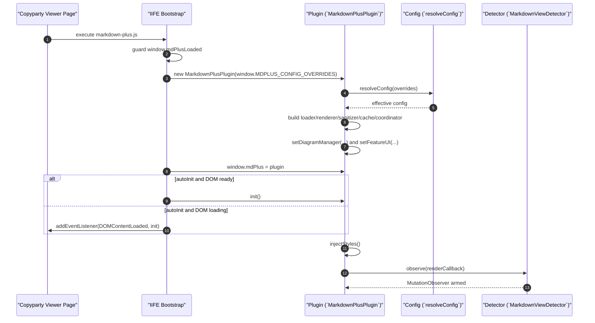
```mermaid
%% From bundle execution to an armed detector.
sequenceDiagram
    autonumber
    participant CP as "Copyparty Viewer Page"
    participant Boot as "IIFE Bootstrap"
    participant Plugin as "Plugin (`MarkdownPlusPlugin`)"
    participant Cfg as "Config (`resolveConfig`)"
    participant Det as "Detector (`MarkdownViewDetector`)"

    CP->>Boot: execute markdown-plus.js
    Boot->>Boot: guard window.mdPlusLoaded
    Boot->>Plugin: new MarkdownPlusPlugin(window.MDPLUS_CONFIG_OVERRIDES)
    Plugin->>Cfg: resolveConfig(overrides)
    Cfg-->>Plugin: effective config
    Plugin->>Plugin: build loader/renderer/sanitizer/cache/coordinator
    Plugin->>Plugin: setDiagramManager(...) and setFeatureUI(...)
    Boot->>Plugin: window.mdPlus = plugin
    alt autoInit and DOM ready
        Boot->>Plugin: init()
    else autoInit and DOM loading
        Boot->>CP: addEventListener(DOMContentLoaded, init)
    end
    Plugin->>Plugin: injectStyles()
    Plugin->>Det: observe(renderCallback)
    Det-->>Plugin: MutationObserver armed
```

**Explanation.** The bundle self-executes. A guard prevents double initialization.
The plugin resolves configuration, constructs the object graph, wires the diagram and
feature subsystems via setters, and publishes `window.mdPlus`. When the DOM is ready,
`init()` injects the stylesheet and arms the detector. No rendering happens yet — the
plugin is now passively watching the page.

### 6.2 View detection (activity)

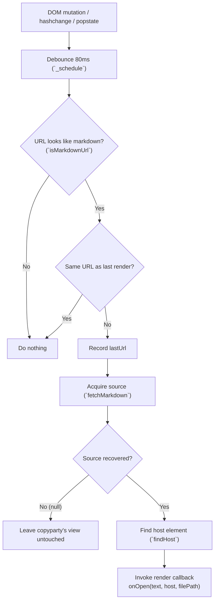
```mermaid
%% Decision flow each time the DOM mutates (debounced).
flowchart TD
    Start["DOM mutation / hashchange / popstate"] --> Debounce["Debounce 80ms (`_schedule`)"]
    Debounce --> IsMd{"URL looks like markdown?<br/>(`isMarkdownUrl`)"}
    IsMd -->|"No"| Stop["Do nothing"]
    IsMd -->|"Yes"| Same{"Same URL as last render?"}
    Same -->|"Yes"| Stop
    Same -->|"No"| Mark["Record lastUrl"]
    Mark --> Fetch["Acquire source (`fetchMarkdown`)"]
    Fetch --> HasText{"Source recovered?"}
    HasText -->|"No (null)"| LeaveCp["Leave copyparty's view untouched"]
    HasText -->|"Yes"| Host["Find host element (`findHost`)"]
    Host --> Cb["Invoke render callback<br/>onOpen(text, host, filePath)"]
```

**Explanation.** Mutations are debounced to coalesce copyparty's incremental DOM
writes. The detector renders at most once per URL (so its own DOM changes do not
loop). If the source cannot be recovered it deliberately leaves copyparty's native
view alone rather than blanking it.

### 6.3 Main render pipeline (sequence)

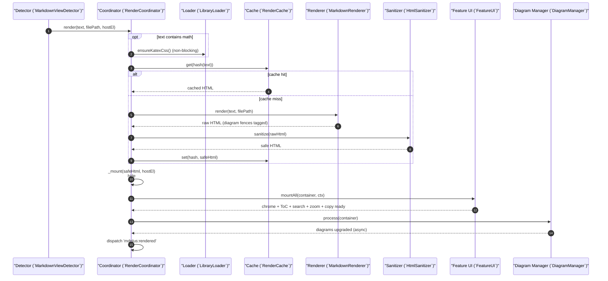
```mermaid
%% The end-to-end render of one markdown view.
sequenceDiagram
    autonumber
    participant Det as "Detector (`MarkdownViewDetector`)"
    participant Co as "Coordinator (`RenderCoordinator`)"
    participant Ld as "Loader (`LibraryLoader`)"
    participant Ca as "Cache (`RenderCache`)"
    participant Re as "Renderer (`MarkdownRenderer`)"
    participant Sa as "Sanitizer (`HtmlSanitizer`)"
    participant FU as "Feature UI (`FeatureUI`)"
    participant DM as "Diagram Manager (`DiagramManager`)"

    Det->>Co: render(text, filePath, hostEl)
    opt text contains math
        Co->>Ld: ensureKatexCss() (non-blocking)
    end
    Co->>Ca: get(hash(text))
    alt cache hit
        Ca-->>Co: cached HTML
    else cache miss
        Co->>Re: render(text, filePath)
        Re-->>Co: raw HTML (diagram fences tagged)
        Co->>Sa: sanitize(rawHtml)
        Sa-->>Co: safe HTML
        Co->>Ca: set(hash, safeHtml)
    end
    Co->>Co: _mount(safeHtml, hostEl)<br/>hide #ml/#mp/#toc, reclaim width
    Co->>FU: mountAll(container, ctx)
    FU-->>Co: chrome + ToC + search + zoom + copy ready
    Co->>DM: process(container)
    DM-->>Co: diagrams upgraded (async)
    Co->>Co: dispatch 'mdplus:rendered'
```

**Explanation.** Math triggers a non-blocking stylesheet load. The document HTML is
cached by content hash (so revisiting or theme-toggling is cheap). After mounting,
the feature UI is mounted **before** diagrams so the toolbar/ToC appear instantly and
never wait on a slow diagram backend; diagram upgrading then runs asynchronously.

### 6.4 Collaboration diagram (numbered interactions)

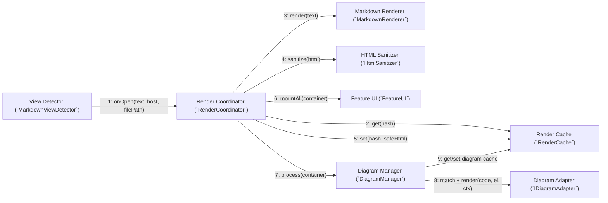
```mermaid
%% Same render scenario, emphasizing object relationships and message order.
%% Numbers match the collaboration summary table below.
flowchart LR
    Detector["View Detector (`MarkdownViewDetector`)"]
    Coordinator["Render Coordinator (`RenderCoordinator`)"]
    Cache["Render Cache (`RenderCache`)"]
    Renderer["Markdown Renderer (`MarkdownRenderer`)"]
    Sanitizer["HTML Sanitizer (`HtmlSanitizer`)"]
    Features["Feature UI (`FeatureUI`)"]
    Diagrams["Diagram Manager (`DiagramManager`)"]
    Adapter["Diagram Adapter (`IDiagramAdapter`)"]

    Detector -->|"1: onOpen(text, host, filePath)"| Coordinator
    Coordinator -->|"2: get(hash)"| Cache
    Coordinator -->|"3: render(text)"| Renderer
    Coordinator -->|"4: sanitize(html)"| Sanitizer
    Coordinator -->|"5: set(hash, safeHtml)"| Cache
    Coordinator -->|"6: mountAll(container)"| Features
    Coordinator -->|"7: process(container)"| Diagrams
    Diagrams -->|"8: match + render(code, el, ctx)"| Adapter
    Diagrams -->|"9: get/set diagram cache"| Cache
```

**Explanation.** The Coordinator is the hub. Steps 3-5 happen only on a cache miss.
Step 6 (features) precedes step 7 (diagrams) by design. The DiagramManager mediates
between the Coordinator and the concrete adapters and reuses the same cache.

#### Collaboration summary table

```
+----+-----------------------------+---------------------------------------------+
| #  | Interaction                 | Purpose                                     |
+----+-----------------------------+---------------------------------------------+
| 1  | Detector -> Coordinator     | Deliver source text, host element, path.    |
| 2  | Coordinator -> Cache        | Look up cached document HTML by hash.        |
| 3  | Coordinator -> Renderer     | markdown-it render on cache miss.           |
| 4  | Coordinator -> Sanitizer    | DOMPurify-sanitize the rendered HTML.        |
| 5  | Coordinator -> Cache        | Store sanitized HTML.                        |
| 6  | Coordinator -> FeatureUI    | Build chrome + ToC/search/zoom/copy.        |
| 7  | Coordinator -> DiagramMgr   | Upgrade tagged diagram blocks.              |
| 8  | DiagramMgr -> Adapter       | Route each block to a matching adapter.      |
| 9  | DiagramMgr -> Cache         | Reuse/store per-diagram output.             |
+----+-----------------------------+---------------------------------------------+
```

### 6.5 Diagram processing (activity)

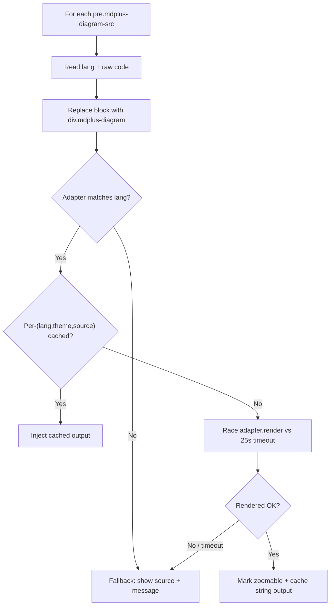
```mermaid
%% Per-block decision flow inside DiagramManager._processOne.
flowchart TD
    Start["For each pre.mdplus-diagram-src"] --> Read["Read lang + raw code"]
    Read --> Replace["Replace block with div.mdplus-diagram"]
    Replace --> Match{"Adapter matches lang?"}
    Match -->|"No"| Fb["Fallback: show source + message"]
    Match -->|"Yes"| CacheChk{"Per-(lang,theme,source) cached?"}
    CacheChk -->|"Yes"| Reuse["Inject cached output"]
    CacheChk -->|"No"| Render["Race adapter.render vs 25s timeout"]
    Render --> Ok{"Rendered OK?"}
    Ok -->|"Yes"| Store["Mark zoomable + cache string output"]
    Ok -->|"No / timeout"| Fb
```

**Explanation.** Every block is first replaced by a placeholder div so the document
layout is stable. Unknown languages and any render error/timeout funnel into the same
graceful fallback (source + inline error). Successful, string-based outputs (Mermaid
SVG, remote ``) are cached per theme; blob-URL outputs are intentionally not
cached.

### 6.6 Mermaid lazy-load lifecycle (state)

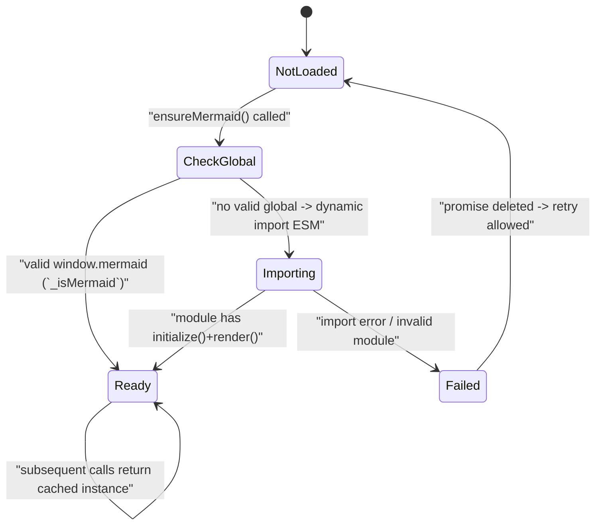
```mermaid
%% LibraryLoader.ensureMermaid state across calls.
stateDiagram-v2
    [*] --> NotLoaded
    NotLoaded --> CheckGlobal: "ensureMermaid() called"
    CheckGlobal --> Ready: "valid window.mermaid (`_isMermaid`)"
    CheckGlobal --> Importing: "no valid global -> dynamic import ESM"
    Importing --> Ready: "module has initialize()+render()"
    Importing --> Failed: "import error / invalid module"
    Failed --> NotLoaded: "promise deleted -> retry allowed"
    Ready --> Ready: "subsequent calls return cached instance"
```

**Explanation.** The loader first trusts a pre-existing global only if it is the real
Mermaid API (copyparty exposes a decoy `window.mermaid`), otherwise dynamic-imports
the ESM build. On failure the memoized promise is cleared so a later block can retry.

### 6.7 Theme toggle (sequence)

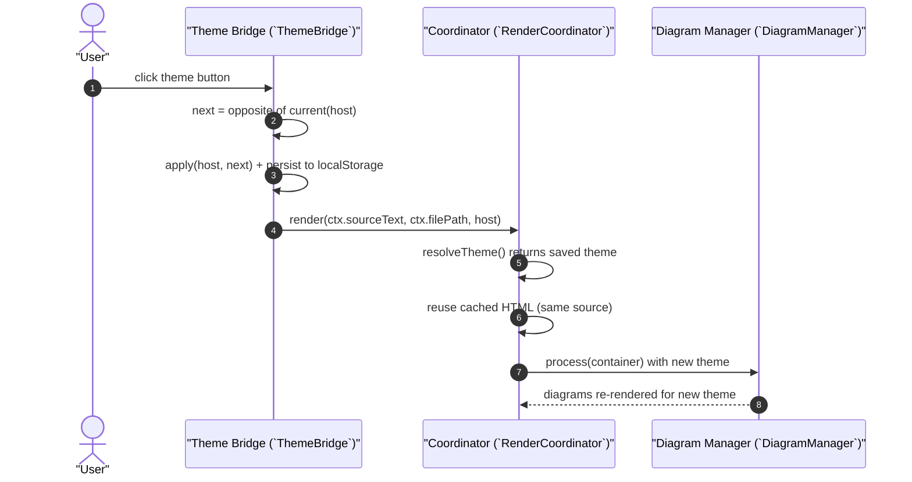
```mermaid
%% Toolbar theme button -> recolored document.
sequenceDiagram
    autonumber
    actor User as "User"
    participant TB as "Theme Bridge (`ThemeBridge`)"
    participant Co as "Coordinator (`RenderCoordinator`)"
    participant DM as "Diagram Manager (`DiagramManager`)"

    User->>TB: click theme button
    TB->>TB: next = opposite of current(host)
    TB->>TB: apply(host, next) + persist to localStorage
    TB->>Co: render(ctx.sourceText, ctx.filePath, host)
    Co->>Co: resolveTheme() returns saved theme
    Co->>Co: reuse cached HTML (same source)
    Co->>DM: process(container) with new theme
    DM-->>Co: diagrams re-rendered for new theme
```

**Explanation.** Toggling persists the choice and re-renders. The document HTML comes
from cache (same source) so only diagrams (whose colors are baked into SVG) actually
re-render, now keyed by the new theme. `resolveTheme()` reads the saved choice first,
so the re-render does not snap back to copyparty's theme — this is the fix for the
"toggle does nothing" bug.

### 6.8 In-document search (activity)

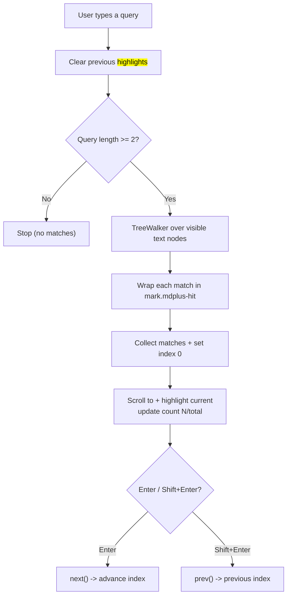
```mermaid
%% SearchController.run on each input event.
flowchart TD
    Input["User types a query"] --> Clear["Clear previous <mark> highlights"]
    Clear --> Len{"Query length >= 2?"}
    Len -->|"No"| Done["Stop (no matches)"]
    Len -->|"Yes"| Walk["TreeWalker over visible text nodes"]
    Walk --> Wrap["Wrap each match in mark.mdplus-hit"]
    Wrap --> Collect["Collect matches + set index 0"]
    Collect --> Focus["Scroll to + highlight current<br/>update count N/total"]
    Focus --> Nav{"Enter / Shift+Enter?"}
    Nav -->|"Enter"| Next["next() -> advance index"]
    Nav -->|"Shift+Enter"| Prev["prev() -> previous index"]
```

**Explanation.** Search rewraps matches on each keystroke (clearing prior wraps
first), skips script/style/existing marks, tracks a current index, and supports
forward/backward navigation with live count feedback.

### 6.9 Export (activity)

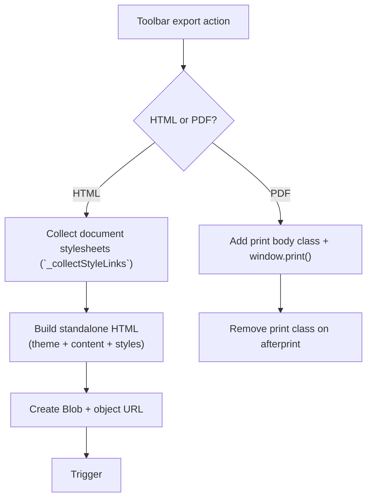
```mermaid
%% ExportMenu paths.
flowchart TD
    Click["Toolbar export action"] --> Which{"HTML or PDF?"}
    Which -->|"HTML"| Collect["Collect document stylesheets (`_collectStyleLinks`)"]
    Collect --> Build["Build standalone HTML<br/>(theme + content + styles)"]
    Build --> Blob["Create Blob + object URL"]
    Blob --> Download["Trigger <a download>"]
    Which -->|"PDF"| Print["Add print body class + window.print()"]
    Print --> Restore["Remove print class on afterprint"]
```

**Explanation.** HTML export serializes the already-rendered content plus the page's
stylesheet links into a self-contained file; PDF uses the browser's print-to-PDF with
a print stylesheet that hides the chrome.

### 6.10 Plugin lifecycle (state)

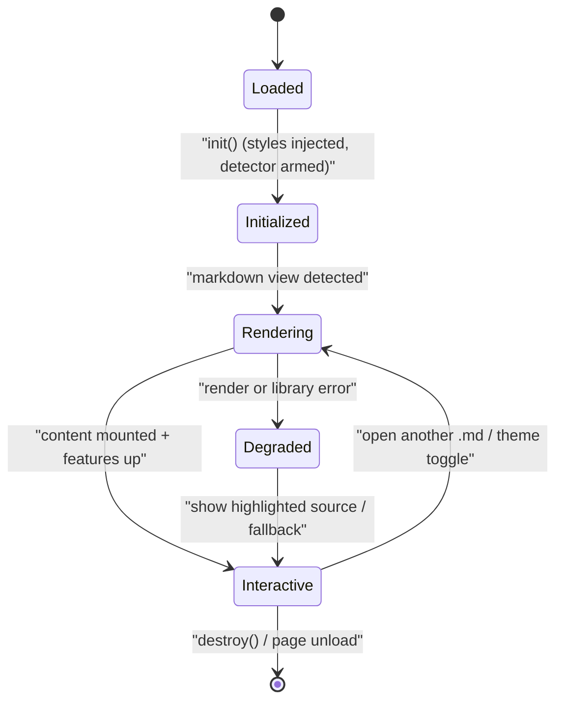
```mermaid
%% Overall plugin lifecycle.
stateDiagram-v2
    [*] --> Loaded
    Loaded --> Initialized: "init() (styles injected, detector armed)"
    Initialized --> Rendering: "markdown view detected"
    Rendering --> Interactive: "content mounted + features up"
    Interactive --> Rendering: "open another .md / theme toggle"
    Rendering --> Degraded: "render or library error"
    Degraded --> Interactive: "show highlighted source / fallback"
    Interactive --> [*]: "destroy() / page unload"
```

**Explanation.** The plugin moves from Loaded to Initialized once, then cycles between
Rendering and Interactive per view. Errors degrade gracefully rather than terminating.

### 6.11 Diagram zoom window (sequence)

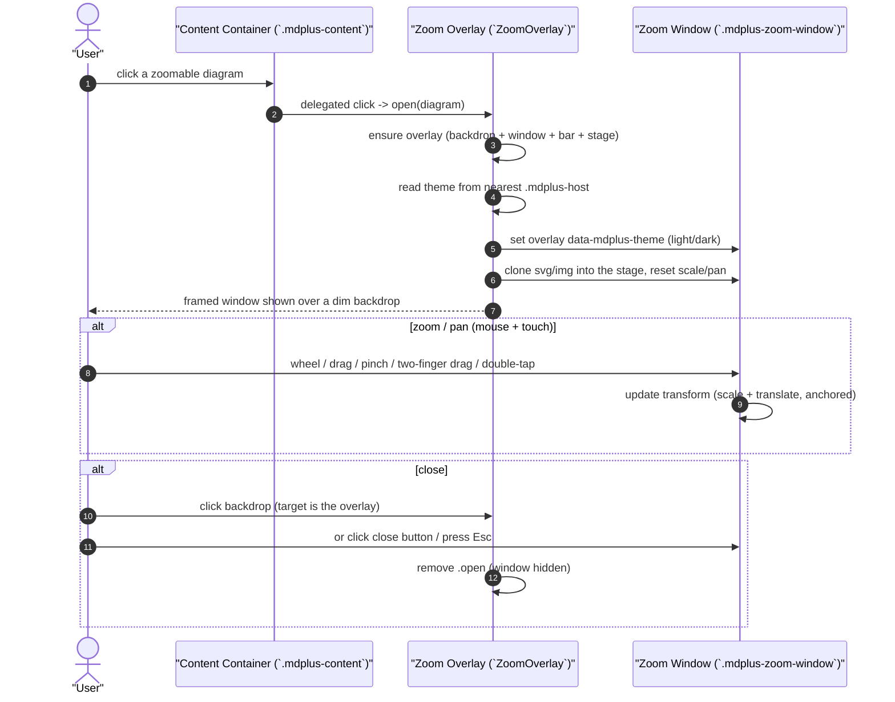
```mermaid
%% Opening, interacting with, and closing the themed, framed zoom window.
sequenceDiagram
    autonumber
    actor User as "User"
    participant Cont as "Content Container (`.mdplus-content`)"
    participant Zoom as "Zoom Overlay (`ZoomOverlay`)"
    participant Win as "Zoom Window (`.mdplus-zoom-window`)"

    User->>Cont: click a zoomable diagram
    Cont->>Zoom: delegated click -> open(diagram)
    Zoom->>Zoom: ensure overlay (backdrop + window + bar + stage)
    Zoom->>Zoom: read theme from nearest .mdplus-host
    Zoom->>Win: set overlay data-mdplus-theme (light/dark)
    Zoom->>Win: clone svg/img into the stage, reset scale/pan
    Zoom-->>User: framed window shown over a dim backdrop
    alt zoom / pan (mouse + touch)
        User->>Win: wheel / drag / pinch / two-finger drag / double-tap
        Win->>Win: update transform (scale + translate, anchored)
    end
    alt close
        User->>Zoom: click backdrop (target is the overlay)
        User->>Win: or click close button / press Esc
        Zoom->>Zoom: remove .open (window hidden)
    end
```

**Explanation.** Clicking a diagram is handled by event delegation on the content
container, which calls `open()`. The overlay (built once) is themed to the current
light/dark selection by copying the nearest host's `data-mdplus-theme`. The diagram is
cloned into the stage of a centered, bordered window over a dim backdrop. Input is
unified through Pointer Events: on a mouse the wheel zooms toward the cursor and
dragging pans; on touch one finger pans and two fingers pinch-zoom and pan (anchored
on the midpoint), and a double-tap toggles zoom. The stage sets `touch-action: none`
so the browser hands these gestures to the plugin instead of scrolling/zooming the
page. Because the window is a centered child, a click on the backdrop targets the
overlay itself and closes it (close button and Esc also work).

### 6.12 View options: full width and ToC auto-hide (activity)

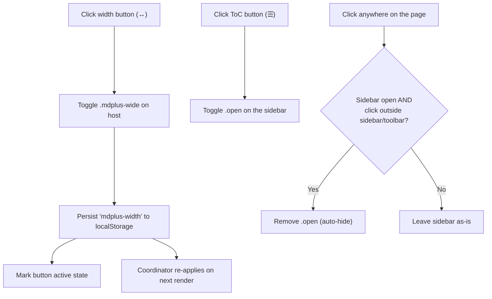
```mermaid
%% Two view-option behaviors driven from the toolbar / outside clicks.
flowchart TD
    WClick["Click width button (↔)"] --> WToggle["Toggle .mdplus-wide on host"]
    WToggle --> WPersist["Persist 'mdplus-width' to localStorage"]
    WPersist --> WBtn["Mark button active state"]
    WPersist --> WApply["Coordinator re-applies on next render"]

    TOpen["Click ToC button (☰)"] --> TToggle["Toggle .open on the sidebar"]
    Outside["Click anywhere on the page"] --> TCheck{"Sidebar open AND<br/>click outside sidebar/toolbar?"}
    TCheck -->|"Yes"| THide["Remove .open (auto-hide)"]
    TCheck -->|"No"| TKeep["Leave sidebar as-is"]
```

**Explanation.** The width toggle is a pure CSS switch: it flips `.mdplus-wide` on the
host (so `.mdplus-content` drops its fixed max-width), persists the choice, and the
coordinator re-applies it on every subsequent render. The ToC drawer opens via its
toolbar button and auto-hides on any outside click, except clicks on the sidebar
itself or the toolbar (so the toggle button keeps working).

### 6.13 Document zoom (activity)

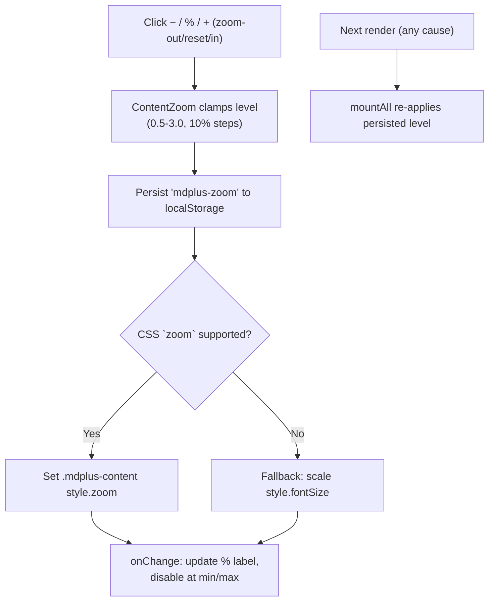
```mermaid
%% ContentZoom driven from the toolbar zoom buttons.
flowchart TD
    Click["Click − / % / + (zoom-out/reset/in)"] --> Calc["ContentZoom clamps level<br/>(0.5-3.0, 10% steps)"]
    Calc --> Persist["Persist 'mdplus-zoom' to localStorage"]
    Persist --> Apply{"CSS `zoom` supported?"}
    Apply -->|"Yes"| Zoom["Set .mdplus-content style.zoom"]
    Apply -->|"No"| Font["Fallback: scale style.fontSize"]
    Zoom --> Refresh["onChange: update % label,<br/>disable at min/max"]
    Font --> Refresh
    ReRender["Next render (any cause)"] --> ReApply["mountAll re-applies persisted level"]
```

**Explanation.** The zoom buttons call `ContentZoom.zoomIn/zoomOut/reset`, which clamp
and persist the level then apply it to the `.mdplus-content` element. The CSS `zoom`
property is used so the font size, images, and diagrams scale together and the layout
reflows (a `font-size` fallback covers browsers without `zoom`). An `onChange` callback
refreshes the toolbar (the middle button shows the current percentage and resets on
click; the out/in buttons disable at the 50%/300% bounds). Because the level is
persisted and re-applied by `mountAll()` on every render, the zoom survives theme
toggles, navigation, and reloads.

---

## 7. Workflow Deep-Dive: Inputs, Intermediates, Outputs per Phase

The primary workflow is **"View a `.md` -> Interactive rendered document."** It is
decomposed into seven phases. For each phase: the input data, the intermediate
artifacts produced, the output data, and a detailed elaboration.

### 7.1 Primary workflow overview (flowchart)

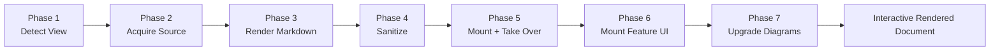
```mermaid
%% The seven phases of the main workflow, left to right.
flowchart LR
    P1["Phase 1<br/>Detect View"] --> P2["Phase 2<br/>Acquire Source"]
    P2 --> P3["Phase 3<br/>Render Markdown"]
    P3 --> P4["Phase 4<br/>Sanitize"]
    P4 --> P5["Phase 5<br/>Mount + Take Over"]
    P5 --> P6["Phase 6<br/>Mount Feature UI"]
    P6 --> P7["Phase 7<br/>Upgrade Diagrams"]
    P7 --> Out["Interactive Rendered Document"]
```

### 7.2 Phase 1 — Detect View

```
+---------------------+-------------------------------------------------------------+
| Aspect              | Detail                                                      |
+---------------------+-------------------------------------------------------------+
| Input data          | DOM mutation events; location.pathname/href; copyparty page |
|                     | structure (textarea#mt, #mw, #mp, #toc).                    |
| Intermediate        | Debounce timer; lastUrl marker; boolean isMarkdownUrl       |
| artifacts           | result.                                                     |
| Output data         | A decision to proceed + (deferred) a render trigger.        |
+---------------------+-------------------------------------------------------------+
```

**Elaboration.** `MarkdownViewDetector.observe()` arms a `MutationObserver` on
`<html>` plus `hashchange`/`popstate` listeners. Each event calls `_schedule()`,
which debounces 80 ms and calls `_check()`. `_check()` short-circuits if the URL is
not markdown or equals `lastUrl` (so the detector acts once per view and ignores the
DOM mutations it itself causes). This phase produces no document data yet; its output
is the gated decision to continue to Phase 2.

### 7.3 Phase 2 — Acquire Source

```
+---------------------+-------------------------------------------------------------+
| Aspect              | Detail                                                      |
+---------------------+-------------------------------------------------------------+
| Input data          | The current document DOM; the file URL (location.href).     |
| Intermediate        | textarea#mt.value (preferred); or a fetch Response          |
| artifacts           | (content-type + body); or a parsed fallback document.      |
| Output data         | rawMarkdown: string (or null to abort and leave copyparty). |
+---------------------+-------------------------------------------------------------+
```

**Elaboration.** `fetchMarkdown()` first reads copyparty's in-DOM `textarea#mt`
value, which already contains the exact source (HTML-unescaped by the browser) — the
fast, no-network path used on copyparty's viewer. If absent, it fetches the URL and
accepts `text/markdown`/`text/plain` bodies directly, or recovers source from a
`<textarea>`/`<pre>` in an HTML response. Returning `null` signals "could not
recover" so the caller leaves copyparty's native view intact. `findHost()` then
returns the render target (`#mw` on copyparty, else a fallback/overlay). Output: the
raw Markdown string plus the chosen host element and `filePath`.

### 7.4 Phase 3 — Render Markdown

```
+---------------------+-------------------------------------------------------------+
| Aspect              | Detail                                                      |
+---------------------+-------------------------------------------------------------+
| Input data          | rawMarkdown: string; filePath: string; config.mathRenderer. |
| Intermediate        | markdown-it token stream; per-fence decisions (diagram vs   |
| artifacts           | code); KaTeX HTML/MathML for math; highlight.js spans.      |
| Output data         | rawHtml: string with diagram fences tagged as              |
|                     | <pre class="mdplus-diagram-src" data-diagram-lang="...">.   |
+---------------------+-------------------------------------------------------------+
```

**Elaboration.** On a cache miss the Coordinator calls `MarkdownRenderer.render()`.
markdown-it parses the source into tokens; the configured plugins handle anchors,
emoji, footnotes, task lists, admonition containers, and (via texmath) KaTeX math.
The custom fence rule inspects each code block's language: a diagram language is
emitted verbatim and tagged for Phase 7; any other language is highlighted by
highlight.js (or HTML-escaped if unknown) and wrapped as `<pre class="hljs
mdplus-code">`. Output is unsanitized HTML — explicitly treated as untrusted. (Note:
math also triggers `LibraryLoader.ensureKatexCss()` non-blocking, so the KaTeX
stylesheet/fonts load in parallel without delaying this phase.)

### 7.5 Phase 4 — Sanitize

```
+---------------------+-------------------------------------------------------------+
| Aspect              | Detail                                                      |
+---------------------+-------------------------------------------------------------+
| Input data          | rawHtml: string (untrusted).                               |
| Intermediate        | DOMPurify parse tree; afterSanitizeAttributes hook applied  |
| artifacts           | to anchors.                                                |
| Output data         | safeHtml: string; stored in RenderCache under hash(text).   |
+---------------------+-------------------------------------------------------------+
```

**Elaboration.** `HtmlSanitizer.sanitize()` runs DOMPurify with HTML+SVG+MathML
profiles, permitting a small attribute allow-list (table/task-list attributes,
`target`/`rel`) while forbidding `script`/`style`/`iframe`/`object`/`embed`/`form`
and inline event handlers. A hook rewrites external links to open safely in a new
tab. The result is cached so future renders of the same source skip Phases 3-4
entirely. KaTeX MathML and styled spans survive; the still-tagged diagram fences pass
through as inert text for Phase 7.

### 7.6 Phase 5 — Mount and Take Over

```
+---------------------+-------------------------------------------------------------+
| Aspect              | Detail                                                      |
+---------------------+-------------------------------------------------------------+
| Input data          | safeHtml: string; hostEl (e.g. copyparty #mw); current      |
|                     | theme via resolveTheme().                                  |
| Intermediate        | host classed .mdplus-host + data-mdplus-theme; copyparty's  |
| artifacts           | #ml/#mp/#toc hidden; host left/right/max-width reset.       |
| Output data         | container: the <article class="mdplus-content"> with the    |
|                     | rendered HTML, ready for enhancement.                      |
+---------------------+-------------------------------------------------------------+
```

**Elaboration.** `_mount()` resolves the theme (explicit/saved > copyparty
`<html class="z|y">` > OS preference), tags the host, hides copyparty's native
loading node, rendered output, and ToC (whose anchors would point into the hidden
output), and on copyparty's wide-screen layout resets the host's left/right offset so
the content uses the full width instead of leaving an empty ToC gutter, and applies
the persisted content-width mode (`.mdplus-wide`, from `localStorage["mdplus-width"]`).
It then creates (or reuses) the `.mdplus-content` article and sets its `innerHTML`.
Output: the live container element other phases enhance.

### 7.7 Phase 6 — Mount Feature UI

```
+---------------------+-------------------------------------------------------------+
| Aspect              | Detail                                                      |
+---------------------+-------------------------------------------------------------+
| Input data          | container; ctx = { filePath, sourceText }; config.features. |
| Intermediate        | chrome (toolbar/ToC drawer/search bar) built once per host  |
| artifacts           | and cached on host.__mdplusChrome; ToC heading list.        |
| Output data         | Interactive chrome on <body>; copy buttons on code blocks;  |
|                     | search/zoom handlers attached; ctx stored for theme toggle. |
+---------------------+-------------------------------------------------------------+
```

**Elaboration.** `FeatureUI.mountAll()` builds the chrome once (appended to `<body>`
to escape copyparty's `#mw` stacking context), then per render adds copy buttons,
rebuilds the ToC from the container's headings, (re)attaches diagram-zoom delegation
and search, and applies the persisted document zoom to the new container. The toolbar
exposes ToC, search, full-width, document zoom (out / level-reset / in), theme,
export, and print actions — each an inline SVG icon (so they render reliably on every
platform, including Android, where the previous printer/download glyphs were missing)
sized for touch via a `(pointer: coarse)` media query. A document-level handler
auto-hides the ToC drawer on outside clicks. This phase runs before diagrams so the UI
is immediately responsive. Output: a fully wired UI plus the stored `ctx` that
ThemeBridge (and the width/zoom toggles) later reuse.

### 7.8 Phase 7 — Upgrade Diagrams

```
+---------------------+-------------------------------------------------------------+
| Aspect              | Detail                                                      |
+---------------------+-------------------------------------------------------------+
| Input data          | container with pre.mdplus-diagram-src blocks; current theme; |
|                     | config diagram backend + URL.                             |
| Intermediate        | per-block div.mdplus-diagram placeholders; per-(lang,theme, |
| artifacts           | source) cache keys; adapter outputs (SVG / object-URL img). |
| Output data         | Rendered diagrams (zoomable) OR graceful fallbacks; cached   |
|                     | string outputs; final 'mdplus:rendered' event.            |
+---------------------+-------------------------------------------------------------+
```

**Elaboration.** `DiagramManager.process()` finds all tagged blocks, derives the
theme, and processes them concurrently. Each block is replaced by a placeholder, then
either served from cache, rendered by the matching adapter (Mermaid in-browser;
PlantUML/Kroki via server) under a 25s timeout, or shown as a fallback (source +
message) on any error. Successful string outputs are cached per theme and marked
zoomable. When all blocks settle, the Coordinator dispatches `mdplus:rendered`. Final
output: the interactive, fully rendered document.

### 7.9 Secondary workflow — Theme Toggle (phase I/O)

```
+----+--------------------+----------------------------+--------------------------+
| #  | Phase              | Input                      | Output                   |
+----+--------------------+----------------------------+--------------------------+
| 1  | Determine next     | current host theme attr    | next = light/dark        |
| 2  | Persist + apply    | next                       | host attr + localStorage |
| 3  | Re-render          | stored ctx.sourceText/path | cached HTML reused       |
| 4  | Recolor diagrams   | new theme                  | diagrams re-rendered     |
+----+--------------------+----------------------------+--------------------------+
```

**Elaboration.** Because the document HTML is cached by source hash, the only real
work on toggle is re-rendering diagrams under the new theme key; `resolveTheme()`
returns the persisted choice so the result is stable.

### 7.10 Secondary workflow — HTML Export (phase I/O)

```
+----+--------------------+----------------------------+--------------------------+
| #  | Phase              | Input                      | Output                   |
+----+--------------------+----------------------------+--------------------------+
| 1  | Collect styles     | document <link>/<style>    | concatenated CSS refs    |
| 2  | Assemble document  | container.innerHTML+theme  | standalone HTML string   |
| 3  | Package + download  | HTML string                | Blob + <a download>      |
+----+--------------------+----------------------------+--------------------------+
```

**Elaboration.** Export captures the rendered output (including Mermaid SVG inline and
PlantUML images by URL) plus the page's stylesheet references, producing a portable
`.html` file; viewing it offline requires the referenced styles/assets to be
reachable (or self-hosted).

### 7.11 Secondary workflow — Full-width Toggle (phase I/O)

```
+----+--------------------+----------------------------+--------------------------+
| #  | Phase              | Input                      | Output                   |
+----+--------------------+----------------------------+--------------------------+
| 1  | Toggle class       | width button click         | host .mdplus-wide on/off |
| 2  | Persist choice     | new state                  | localStorage mdplus-width|
| 3  | Reflect on button  | new state                  | button active class      |
| 4  | Re-apply on render | localStorage value         | _mount sets host class   |
+----+--------------------+----------------------------+--------------------------+
```

**Elaboration.** Toggling is a pure CSS switch (no re-render): flipping `.mdplus-wide`
on the host makes `.mdplus-content` drop its fixed `max-width: 980px` and span the
host. The choice persists and the coordinator re-applies it on every later render, so
the preference survives navigation, theme toggles, and reloads.

### 7.12 Secondary workflow — Diagram Zoom Window (phase I/O)

```
+----+--------------------+----------------------------+--------------------------+
| #  | Phase              | Input                      | Output                   |
+----+--------------------+----------------------------+--------------------------+
| 1  | Open               | click a zoomable diagram   | overlay + window shown   |
| 2  | Theme              | nearest host theme attr    | window themed light/dark |
| 3  | Load               | cloned svg/img             | diagram in the stage     |
| 4  | Interact           | wheel / drag / pinch /     | anchored scale +         |
|    |                    | two-finger drag / dbl-tap  | translate transform      |
| 5  | Close              | backdrop / close / Esc     | overlay .open removed    |
+----+--------------------+----------------------------+--------------------------+
```

**Elaboration.** The overlay (built once, attached to `<body>`) is a dim backdrop
containing a centered, bordered window themed to the current selection. The chosen
diagram/image is cloned into the window's stage; a single Pointer-Events code path
serves mouse (wheel zoom + drag pan), touch (one-finger pan, two-finger pinch-zoom +
pan, double-tap), and pen, with `touch-action: none` so the browser does not steal the
gestures. A click on the backdrop (outside the window frame), the close button, or Esc
closes it.

### 7.13 Secondary workflow — Document Zoom (phase I/O)

```
+----+--------------------+----------------------------+--------------------------+
| #  | Phase              | Input                      | Output                   |
+----+--------------------+----------------------------+--------------------------+
| 1  | Compute level      | button + current level     | clamped level (0.5-3.0)  |
| 2  | Persist            | new level                  | localStorage mdplus-zoom |
| 3  | Apply scale        | .mdplus-content element     | style.zoom (or fontSize) |
| 4  | Refresh toolbar    | new level                  | % label + min/max state  |
| 5  | Re-apply on render | localStorage value         | mountAll re-applies level|
+----+--------------------+----------------------------+--------------------------+
```

**Elaboration.** Distinct from the diagram zoom *window* (§7.12), this scales the
*whole document* via CSS `zoom` on `.mdplus-content` (font-size fallback), so text,
images, and diagrams grow/shrink together. The level is clamped, persisted, and
re-applied on every render, mirroring the full-width toggle.

---

## 8. Data Design and Contracts

### 8.1 Configuration object (effective config)

```
+----------------------+-----------------+-------------------------------------------+
| Key                  | Default         | Meaning                                   |
+----------------------+-----------------+-------------------------------------------+
| diagramBackend       | "mermaid+puml"  | "mermaid+puml" or "kroki".                |
| diagramBackendUrl    | null            | PlantUML/Kroki base URL (PlantUML/Graphviz|
|                      |                 | only).                                   |
| diagramFormat        | "svg"           | "svg" or "png" for server diagrams.       |
| assetBaseUrl         | jsDelivr CDN    | Base for lazy Mermaid + KaTeX CSS.        |
| mermaidUrl           | null            | Full override for the Mermaid ESM URL.    |
| katexCssUrl          | null            | Full override for the KaTeX CSS URL.      |
| mathRenderer         | "KaTeX"         | "KaTeX" or "none".                        |
| mermaidSecurityLevel | "strict"        | Mermaid security level.                   |
| features             | all true        | { toc, search, zoom, contentZoom, export, |
|                      |                 | copyCode }.                               |
| theme                | "auto"          | "auto" / "light" / "dark".                |
| viewerSelector       | null            | Explicit host selector override.          |
| autoInit             | true            | Observe + render automatically.           |
+----------------------+-----------------+-------------------------------------------+
```

### 8.2 Key intermediate data shapes

```
+----------------------------+------------------------------------------------------+
| Artifact                   | Shape / notes                                        |
+----------------------------+------------------------------------------------------+
| Diagram fence (post-render)| <pre class="mdplus-diagram-src"                       |
|                            |   data-diagram-lang="mermaid|plantuml|...">           |
|                            |   <code>RAW SOURCE</code></pre>                      |
| Code fence (post-render)   | <pre class="hljs mdplus-code"><code class=            |
|                            |   "language-xx">HIGHLIGHTED</code></pre>             |
| Mounted container          | <article class="mdplus-content"> inside the host;     |
|                            | host has class mdplus-host + data-mdplus-theme        |
|                            | (+ mdplus-wide when full-width mode is on); the       |
|                            | content carries a style.zoom (or fontSize) when       |
|                            | document zoom != 100%.                                |
| Rendered diagram           | <div class="mdplus-diagram" data-diagram-lang         |
|                            | [data-zoomable]> with SVG or  child.            |
| Zoom window (DOM)          | <div class="mdplus-zoom-overlay mdplus-host"          |
|                            | data-mdplus-theme=...> > .mdplus-zoom-window >        |
|                            | (.mdplus-zoom-bar + .mdplus-zoom-stage).             |
| Cache key (document)       | FNV-1a hex of the full source text.                  |
| Cache key (diagram)        | "diag:" + FNV-1a of "lang|theme|source".             |
| Render context (ctx)       | { filePath, sourceText, host, container }.            |
| Persisted prefs            | localStorage: mdplus-theme (light|dark),              |
|                            | mdplus-width (wide|fixed), mdplus-zoom (number, e.g.  |
|                            | 1.3).                                                |
+----------------------------+------------------------------------------------------+
```

### 8.3 Public API and events

```
+----------------------------------+-------------------------------------------------+
| Surface                          | Description                                     |
+----------------------------------+-------------------------------------------------+
| window.mdPlus                    | The MarkdownPlusPlugin instance.                |
| window.mdPlus.init()             | Arm detection + inject styles (idempotent).     |
| window.mdPlus.renderInto(el,t,p) | Render text into an element (demo/test/manual).  |
| window.mdPlus.destroy()          | Disconnect the detector.                        |
| window.MDPLUS_CONFIG             | Read by resolveConfig (set via --html-head).    |
| window.MDPLUS_CONFIG_OVERRIDES   | Constructor overrides (highest precedence).      |
| CustomEvent "mdplus:rendered"    | Dispatched on the container after a render.      |
+----------------------------------+-------------------------------------------------+
```

---

## 9. Cross-Cutting Concerns

```
+------------------+--------------------------------------------------------------+
| Concern          | Design response                                              |
+------------------+--------------------------------------------------------------+
| Security         | All rendered HTML/SVG/MathML sanitized (DOMPurify); script/   |
|                  | style/iframe forbidden; external links rel=noopener; no       |
|                  | public diagram host by default (SSRF/privacy).               |
| Performance      | Lazy-load Mermaid + KaTeX CSS; two-level cache; feature UI    |
|                  | before diagrams; concurrent diagram processing; 25s timeout.  |
| Resilience       | Cache-miss isolation, per-diagram fallback, library retry on  |
|                  | failure, null-source abort that preserves copyparty's view.   |
| Offline / airgap | assetBaseUrl/mermaidUrl/katexCssUrl + self-hosted diagram      |
|                  | server => zero external requests.                           |
| Theming          | resolveTheme precedence (explicit/saved > copyparty > OS);    |
|                  | diagrams recolored on toggle via cache-keyed re-render; the   |
|                  | zoom window is themed to match.                              |
| View options     | Full-width toggle, document zoom (50-300%), and ToC drawer    |
|                  | (auto-hide on outside click); all persisted/re-applied;       |
|                  | chrome on <body> so it is never trapped in #mw's context.    |
| Accessibility /  | Toolbar buttons are inline SVG (currentColor) so they render  |
| mobile           | on every platform incl. Android (the old printer/download     |
|                  | glyphs were missing there); a (pointer: coarse) media query   |
|                  | gives ~44px touch targets; icon buttons carry aria-labels;    |
|                  | the zoom window supports pinch-zoom + one/two-finger pan +     |
|                  | double-tap (touch-action:none) for usable touch gestures.    |
| Compatibility    | DOM/URL detection + known ids, configurable viewerSelector;   |
|                  | no dependence on copyparty private functions.               |
+------------------+--------------------------------------------------------------+
```

---

## 10. Copyparty Integration Contract

```
+----------------------+-------------------------------------------------------------+
| copyparty element /  | How mdplus uses it                                          |
| flag                 |                                                            |
+----------------------+-------------------------------------------------------------+
| --js-other           | The injection point mdplus uses (the markdown viewer page).  |
| --js-browser         | NOT used by mdplus; free for the companion Video.js plugin   |
|                      | on the file-browser page (the two coexist on diff. pages).   |
| --html-head          | Carries window.MDPLUS_CONFIG.                              |
| `.md?v` URL          | The viewer page is served for a markdown file with ?v.       |
| textarea#mt          | Source of truth for the raw markdown (read .value).         |
| #mw                  | Render host (the plugin takes it over, resets its width).    |
| #mp (.mdo)           | copyparty's native output; hidden by the plugin.            |
| #ml                  | copyparty's "Loading" node; hidden.                        |
| #toc                 | copyparty's native ToC; hidden (links target hidden #mp).   |
| <html class="z|y">   | copyparty's dark/light signal; read by resolveTheme.        |
| #mh (z-index 9)      | copyparty's header; reason the chrome lives on <body>.      |
+----------------------+-------------------------------------------------------------+
```

**Explanation.** mdplus deliberately reads copyparty's already-present source
(`#mt`), renders into copyparty's content wrapper (`#mw`), and suppresses the native
output it replaces, while keeping copyparty's header (`#mh`) functional. Its floating
chrome is mounted on `<body>` so copyparty's positive-z-index header cannot paint over
it.

**Deployment note.** Because mdplus loads via `--js-other` and the companion
[Video.js plugin](https://github.com/techcaotri/copyparty-video-plugin) loads via
`--js-browser`, both can run in the same copyparty instance without contending for one
flag. The built bundle is served from a copyparty volume so the browser fetches it
same-origin while authenticated; in the reference deployment the dev tree is exposed
read-only (`-v /home/tripham/Dev:/dev:r,...`) and the systemd unit is generated by
`install_copyparty_service.sh` (per-feature toggles, defaults all on). See the README
for the launcher and installer.

---

## 11. Extensibility Guide

### 11.1 Add a new diagram type (sequence)

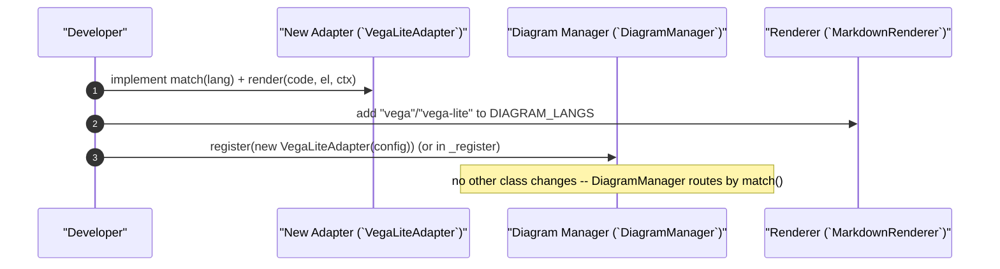
```mermaid
%% Adding "vega-lite" support as a new adapter.
sequenceDiagram
    autonumber
    participant Dev as "Developer"
    participant Ad as "New Adapter (`VegaLiteAdapter`)"
    participant DM as "Diagram Manager (`DiagramManager`)"
    participant Re as "Renderer (`MarkdownRenderer`)"

    Dev->>Ad: implement match(lang) + render(code, el, ctx)
    Dev->>Re: add "vega"/"vega-lite" to DIAGRAM_LANGS
    Dev->>DM: register(new VegaLiteAdapter(config)) (or in _register)
    Note over DM: no other class changes -- DiagramManager routes by match()
```

**Explanation.** New diagram types require only (a) tagging the language in
`DIAGRAM_LANGS` so the fence rule passes it through, and (b) an adapter implementing
the `match`/`render` contract registered with `DiagramManager`. Nothing else changes,
demonstrating the Strategy/Adapter seam.

### 11.2 Add a new feature control

```
+------+-----------------------------------------------------------------------+
| Step | Action                                                                |
+------+-----------------------------------------------------------------------+
| 1    | Create features/<feature>.js with a small controller class.           |
| 2    | Instantiate it in FeatureUI's constructor.                            |
| 3    | Add a toolbar button + dispatch case in _buildChrome.                 |
| 4    | Invoke it from mountAll (per render) if the feature flag is enabled.   |
+------+-----------------------------------------------------------------------+
```

---

## 12. Appendix: File Map, Config Reference, Glossary

### 12.1 Source file map

```
src/integration/index.js          MarkdownPlusPlugin + bootstrap + injectStyles
src/integration/config.js         DEFAULT_CONFIG + resolveConfig + mergeConfig
src/integration/library-loader.js LibraryLoader (ensureMermaid/ensureKatexCss)
src/integration/detector.js       MarkdownViewDetector (observe/_check/fetchMarkdown)
src/integration/coordinator.js    RenderCoordinator (render/_mount/resolveTheme)
src/integration/cache.js          RenderCache (hash/get/set)
src/integration/sanitizer.js      HtmlSanitizer (sanitize)
src/integration/styles.css        themed content + chrome CSS (inlined at build)
src/renderer/markdown-renderer.js MarkdownRenderer + DIAGRAM_LANGS
src/diagrams/index.js             DiagramManager
src/diagrams/mermaid-adapter.js   MermaidAdapter
src/diagrams/plantuml-adapter.js  PlantUmlAdapter
src/diagrams/kroki-adapter.js     KrokiAdapter
src/features/index.js             FeatureUI (+ SVG toolbar ICONS)
src/features/toc.js               TocPanel
src/features/search.js            SearchController
src/features/zoom.js              ZoomOverlay (diagram zoom window)
src/features/content-zoom.js      ContentZoom (whole-document zoom)
src/features/export.js            ExportMenu
src/features/theme-bridge.js      ThemeBridge
src/vendor/mpu/...                plantuml-encoder, diagram-themes, constants (copied)
build.mjs                         esbuild bundler
```

### 12.2 Glossary

```
+----------------------+--------------------------------------------------------------+
| Term                 | Meaning                                                      |
+----------------------+--------------------------------------------------------------+
| mdplus               | Short name for this plugin (window.mdPlus).                  |
| Composition Root     | The single place where the object graph is constructed.      |
| Adapter / Strategy   | Interchangeable diagram renderers behind one interface.      |
| Facade               | A simplified front (FeatureUI, LibraryLoader) over subsystems.|
| Vendoring            | Copying upstream source into the repo (no runtime dependency).|
| Host                 | The DOM element mdplus renders into (copyparty #mw).         |
| Chrome               | The floating UI (toolbar, ToC drawer, search bar).          |
| Take over            | Hiding copyparty's native output and rendering our own.      |
| Cache-aside          | Check cache, compute on miss, store result.                 |
| FNV-1a               | The fast non-cryptographic hash used for cache keys.        |
| Full-width mode      | .mdplus-wide on the host removes the content max-width.      |
| Backdrop             | The dim layer behind the zoom window; click it to close.     |
| Zoom window          | The centered, themed, framed diagram viewer.                |
| Document zoom        | Toolbar zoom in/out that CSS-`zoom`s .mdplus-content (font,  |
|                      | images, diagrams together); distinct from the zoom window.   |
+----------------------+--------------------------------------------------------------+
```

---

*End of document.*
