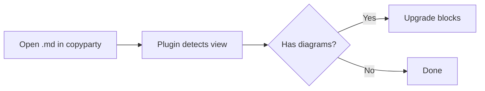
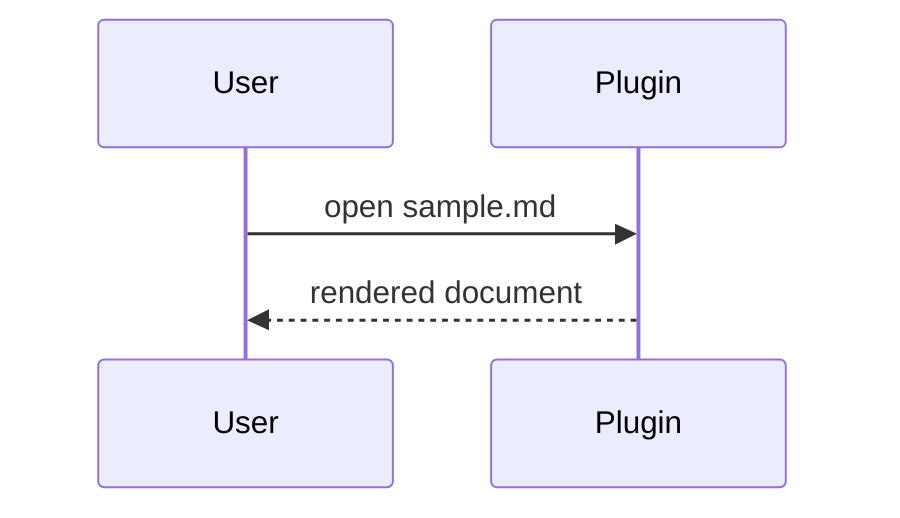
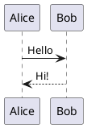

# Copyparty Markdown Viewer — Sample

This file exercises the plugin's features inside the **real copyparty** markdown
viewer.

## Text and code

Some **bold**, _italic_, `inline code`, and a [link](https://github.com/9001/copyparty).

```js
function greet(name) {
  return `hello ${name}`;
}
greet("world");
```

## Math (KaTeX)

Inline: $a^2 + b^2 = c^2$ and a block:

$$
\int_{-\infty}^{\infty} e^{-x^2}\,dx = \sqrt{\pi}
$$

## Task list

- [x] Render markdown
- [x] Math
- [ ] Take over the world

::: tip Pro tip
Diagrams below are rendered client-side by the plugin.
:::

## Mermaid





## PlantUML



## Table

| Feature | Status |
|---------|--------|
| Mermaid | yes    |
| PlantUML| needs server |
| Math    | yes    |
